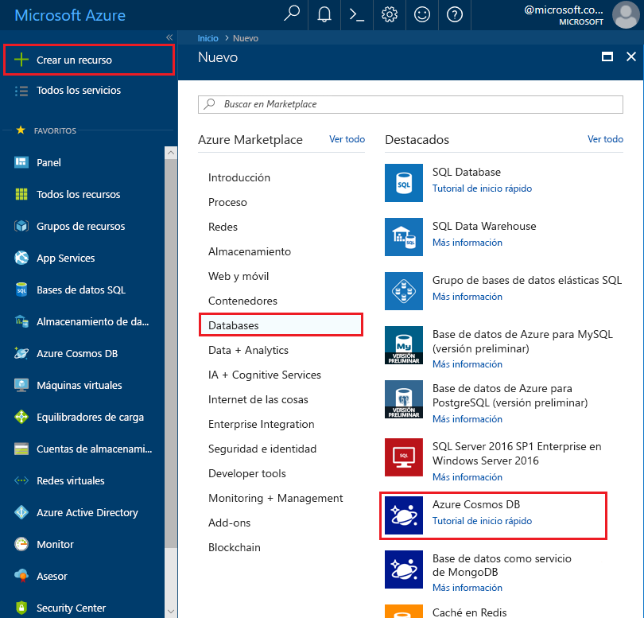

1. En una nueva ventana del explorador, inicie sesión en [Azure Portal](https://portal.azure.com/).
2. Haga clic en **Nuevo** > **Databases** > **Azure Cosmos DB**.
   
   

3. En la página **Nueva cuenta**, especifique la configuración de la nueva cuenta de Azure Cosmos DB. 
 
    Configuración|Valor sugerido|Descripción
    ---|---|---
    ID|*Escriba un nombre único*|Escriba un nombre único para identificar esta cuenta de Azure Cosmos DB. Como *documents.azure.com* se anexa al identificador que proporcione para crear el punto de contacto, debe usar un identificador único pero reconocible.  El identificador puede contener solo letras minúsculas, números y el carácter guion (-), y debe tener una extensión de entre 3 y 50 caracteres.
    API|Cassandra|La API determina el tipo de cuenta que se va a crear. Azure Cosmos DB proporciona cinco API que se adaptan a las necesidades de la aplicación: SQL (base de datos de documentos), Gremlin (base de datos de grafos), MongoDB (base de datos de documentos), Azure Table y Cassandra, y cada una de ellas requiere una cuenta independiente.   Seleccione **Cassandra** porque en esta guía de inicio rápido va a crear una base de datos columnar que se puede consultar mediante la sintaxis SQL.  Si Cassandra (base de datos columnar) no se muestra en la lista, deberá [solicitar unirse](../articles/cosmos-db/cassandra-introduction.md#sign-up-now) al programa de versión preliminar de la API de Cassandra.   [Más información acerca de API de Cassandra](../articles/cosmos-db/cassandra-introduction.md)|
    La suscripción|*Su suscripción*|Seleccione la suscripción de Azure que desea usar para esta cuenta de Azure Cosmos DB. 
    Grupo de recursos|*Escriba el mismo nombre único que se proporcionó anteriormente en el identificador*|Escriba un nombre nuevo de grupo de recursos para la cuenta. Para simplificar, puede usar el mismo nombre del identificador. 
    Ubicación|*Seleccione la región más cercana a los usuarios*|Seleccione la ubicación geográfica en la que se va a hospedar la cuenta de Azure Cosmos DB. Use la ubicación más cercana a los usuarios para proporcionarles el acceso más rápido a los datos.
    Anclar al panel | Seleccionar | Active esta casilla para que la nueva cuenta de la base de datos se agregue al panel del portal para facilitar el acceso.

    A continuación, haga clic en **Crear**.

    

4. La cuenta tarda unos minutos en crearse. Durante la creación de la cuenta, el panel del portal muestra el icono de **implementación de Azure Cosmos DB**.

    

    Una vez creada la cuenta, aparece la página **¡Enhorabuena! Se ha creado su cuenta de Azure Cosmos DB**. 

