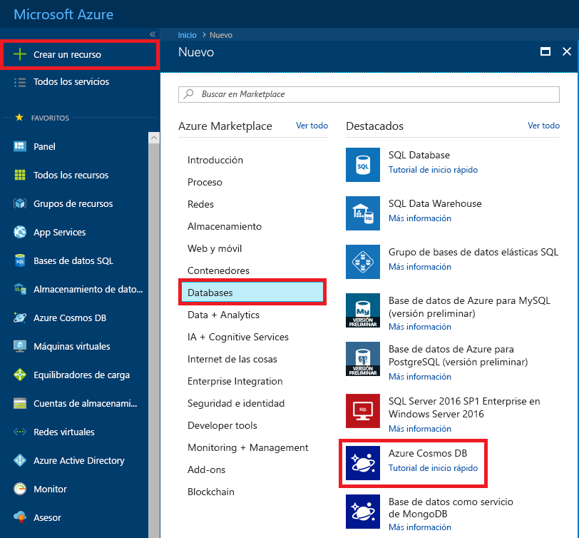
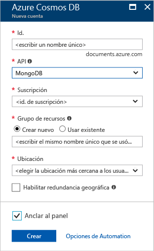
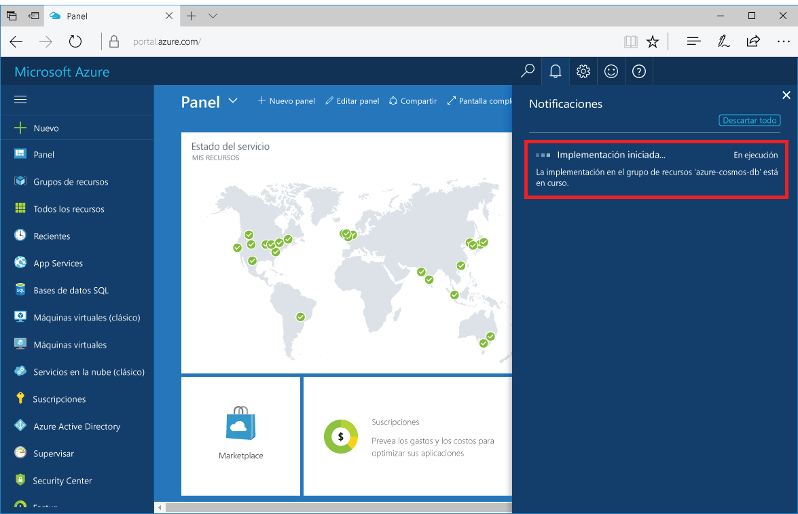
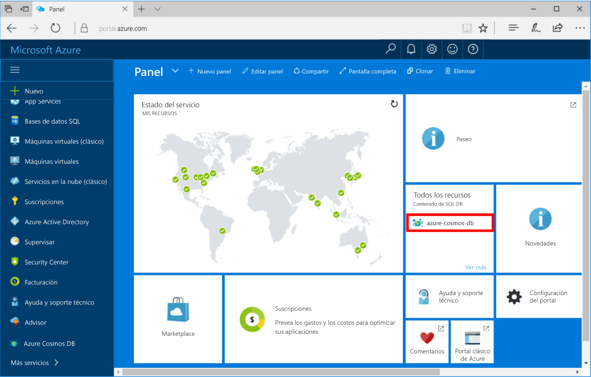

1. En una nueva ventana, inicie sesión en [Azure Portal](https://portal.azure.com/).
2. En el menú de la izquierda, haga clic en **Nuevo**, luego en **Bases de datos** y, finalmente, en **Azure Cosmos DB**, haga clic en **Crear**.
   
   

3. En la hoja **Nueva cuenta**, especifique la configuración que quiera para la cuenta de Azure Cosmos DB. 

    Con Azure Cosmos DB, puede elegir uno de cuatro modelos de programación: Gremlin (grafo), MongoDB, SQL (DocumentDB) y Table (clave-valor). 
       
    En esta guía de inicio rápido programaremos con la API MongoDB, por lo que elegirá **MongoDB** al rellenar el formulario. Pero si tiene datos de grafos para una aplicación de redes sociales, datos de documentos de una aplicación de catálogo o datos de clave-valor (tabla), debe tener en cuenta que Azure Cosmos DB puede proporcionar una plataforma de servicio de base de datos distribuida globalmente y de alta disponibilidad para todas las aplicaciones críticas.

    Rellene la hoja **Nueva cuenta** con la información de la tabla como guía.
 
    
   
    Configuración|Valor sugerido|Descripción
    ---|---|---
    ID|*Valor único*|Nombre único elegido para identificar la cuenta de Azure Cosmos DB. Se anexará *documents.azure.com* al identificador que proporcione para crear el URI, por lo que debe usar un identificador único pero reconocible. El identificador solo puede contener minúsculas, números y el carácter "-". Además, debe tener entre 3 y 50 caracteres.
    API|MongoDB|La API determina el tipo de cuenta que se va a crear. Azure Cosmos DB proporciona cinco API que se adaptan a las necesidades de la aplicación: SQL (base de datos de documentos), Gremlin (base de datos de grafos), MongoDB (base de datos de documentos), Azure Table y Cassandra, y cada una de ellas requiere una cuenta independiente.   Seleccione **MongoDB** porque en este inicio rápido va a crear una base de datos de documentos que se puede consultar mediante MongoDB.  [Más información sobre la API de MongoDB](../articles/cosmos-db/mongodb-introduction.md)|
    La suscripción|*Su suscripción*|Suscripción de Azure que quiere usar para la cuenta de Azure Cosmos DB. 
    Grupo de recursos|*Mismo valor que el identificador*|Nombre del nuevo grupo de recursos para la cuenta. Para simplificar, puede usar el mismo nombre del identificador. 
    Ubicación|*Región más cercana a los usuarios*|Ubicación geográfica en la que se va a hospedar la cuenta de Azure Cosmos DB. Elija la ubicación más cercana a los usuarios para proporcionarles el acceso más rápido a los datos.

4. Haga clic en **Crear** para crear la cuenta.
5. En la barra de herramientas, haga clic en **Notificaciones** para supervisar el proceso de implementación.

    

6.  Una vez completada la implementación, abra la nueva cuenta desde el icono Todos los recursos. 

    
