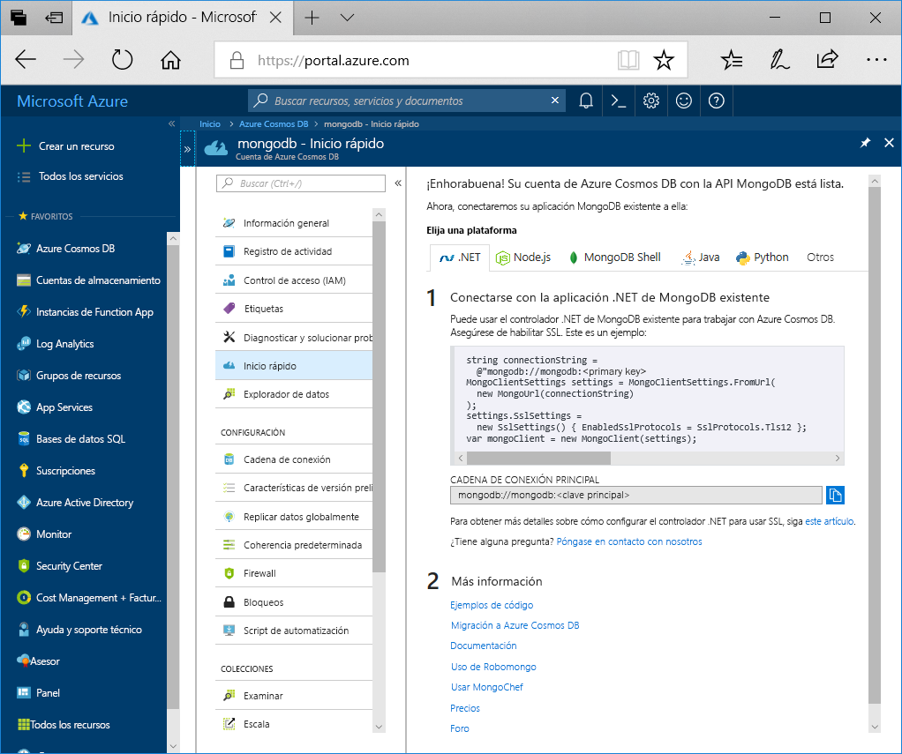

1. En una nueva ventana, inicie sesión en [Azure Portal](https://portal.azure.com/).
2. En el menú de la izquierda, haga clic en **Crear un recurso**, luego en **Bases de datos** y, finalmente, en **Azure Cosmos DB**, haga clic en **Crear**.
   
   

3. En la hoja **Nueva cuenta**, especifique **MongoDB** como la API y rellene la configuración que desee para la cuenta de Azure Cosmos DB.
 
    * **ID** tiene que ser un nombre único elegido para identificar la cuenta de Azure Cosmos DB. Solo se admiten minúsculas, números y el carácter "-", y tiene que tener entre 3 y 50 caracteres.
    * **Suscripción** es su suscripción a Azure. Se rellenará automáticamente.
    * **Grupo de recursos** es el grupo de recursos para la cuenta de Azure Cosmos DB. Seleccione **Crear nuevo** y, después, escriba un nombre nuevo de grupo de recursos para la cuenta. Para simplificar, puede usar el mismo nombre del identificador.
    * **Ubicación** es la ubicación geográfica donde se encuentra la instancia de Azure Cosmos DB. Elija la ubicación más cercana a los usuarios.

    A continuación, haga clic en **Crear**.

    

4. La cuenta tarda unos minutos en crearse. Espere a que el portal muestre la página **¡Enhorabuena! Su cuenta de Azure Cosmos DB con la API MongoDB está lista**.

    
