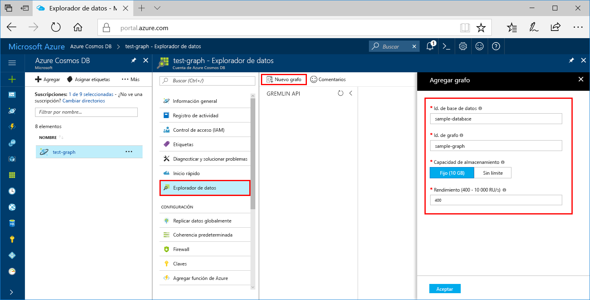

Ahora puede usar la herramienta Explorador de datos en Azure Portal para crear una base de datos de grafos. 

1. Haga clic en **Explorador de datos** > **Nuevo gráfico**.

    El área **Agregar gráfico** se muestra en el extremo derecho, pero es posible que haya que desplazarse hacia la derecha para verlo.

    

2. En la página **Agregar gráfico**, especifique la configuración del nuevo gráfico.

    Configuración|Valor sugerido|DESCRIPCIÓN
    ---|---|---
    Identificador de base de datos|sample-database|Escriba *sample-database* como nombre de la nueva base de datos. Los nombres de bases de datos deben tener entre 1 y 255 caracteres y no pueden contener `/ \ # ?` o un espacio al final.
    Identificador de grafo|sample-graph|Escriba *sample-graph* como nombre de la nueva colección. Los nombres de grafo tienen los mismos requisitos de caracteres que los identificadores de base de datos.
    Capacidad de almacenamiento|Fija (10 GB)|Deje el valor predeterminado **Fija (10 GB)**. Este valor corresponde a la capacidad de almacenamiento de la base de datos.
    Throughput|400 RU|Cambie el rendimiento a 400 unidades de solicitud por segundo (RU/s). Si quiere reducir la latencia, puede escalar verticalmente el rendimiento más adelante.

3. Una vez que haya rellenado el formulario, haga clic en **Aceptar**.
