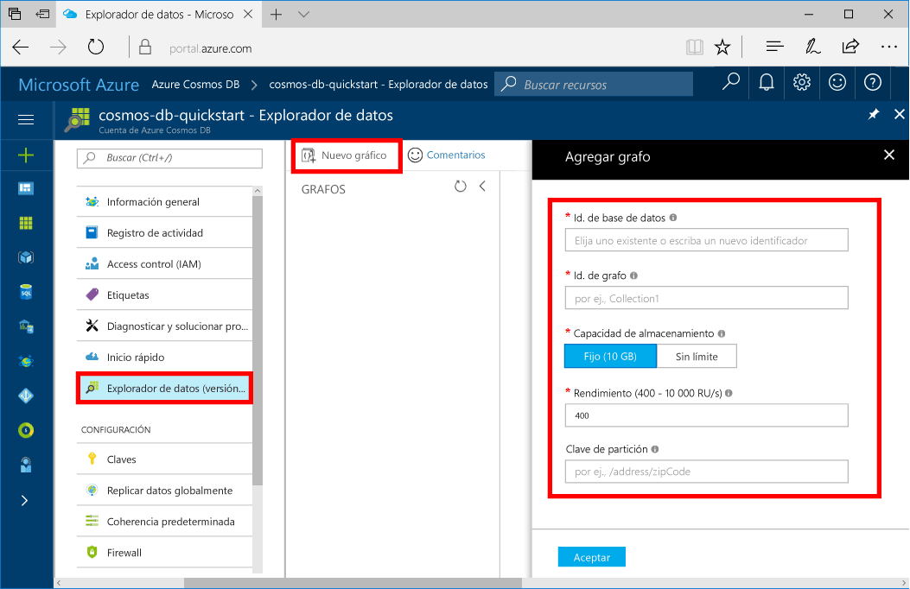

Ahora puede usar la herramienta Explorador de datos en Azure Portal para crear una base de datos de grafos. 

1. En Azure Portal, en el menú de navegación izquierdo, haga clic en **Explorador de datos (versión preliminar)**. 
2. En la hoja **Explorador de datos (Vista previa)**, haga clic en **New Graph** (Nuevo grafo) y rellene la página con la información siguiente.

    

    Configuración|Valor sugerido|Descripción
    ---|---|---
    Id. de base de datos|sample-database|Identificador de la nueva base de datos. Los nombres de bases de datos deben tener entre 1 y 255 caracteres y no pueden contener `/ \ # ?` o un espacio al final.
    Graph id (Id. de grafo)|sample-graph|Identificador del nuevo grafo. Los nombres de grafo tienen los mismos requisitos de caracteres que los identificadores de base de datos.
    Capacidad de almacenamiento| 10 GB|Deje el valor predeterminado. Se trata de la capacidad de almacenamiento de la base de datos.
    Rendimiento|400 RU|Deje el valor predeterminado. Se puede escalar el rendimiento más adelante si quiere reducir la latencia.
    RU/m|Off|Deje el valor predeterminado. 
    Clave de partición|/userid|Clave de partición que distribuirá los datos uniformemente a cada partición. La selección de la clave de partición correcta es importante al crear un gráfico de rendimiento. Obtenga más información al respecto en [Diseño de la creación de particiones](../articles/cosmos-db/partition-data.md#designing-for-partitioning).

3. Una vez que haya rellenado el formulario, haga clic en **Aceptar**.