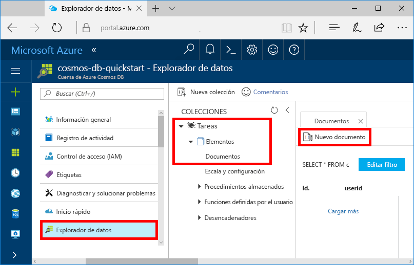
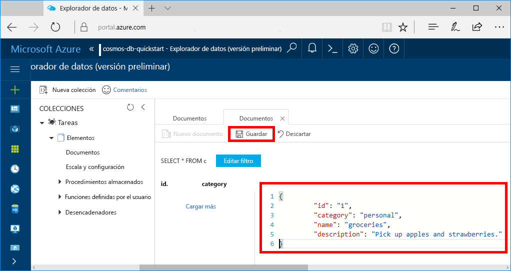

Ahora puede agregar datos a la nueva colección mediante el Explorador de datos.

1. En el Explorador de datos, la nueva base de datos aparece en el panel Colecciones. Expanda la base de datos **Tareas**, expanda la colección **Elementos**, haga clic en **Documentos** y, después, haga clic en **Nuevos documentos**. 

   
  
2. Ahora agregue un documento a la colección con la estructura siguiente.

     ```json
     {
         "id": "1",
         "category": "personal",
         "name": "groceries",
         "description": "Pick up apples and strawberries.",
         "isComplete": false
     }
     ```

3. Cuando haya agregado el archivo JSON a la pestaña **Documentos**, haga clic en **Guardar**.

    

4.  Cree y guarde un documento más donde insertará un valor único para la propiedad `id` y cambie las demás propiedades como corresponda. Los nuevos documentos pueden tener la estructura que quiera, ya que Azure Cosmos DB no impone ningún esquema en los datos.