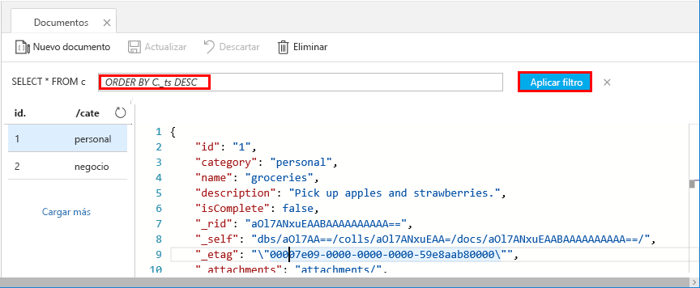

Ahora puede usar consultas en el Explorador de datos para recuperar y filtrar los datos.

1. Vea que de forma predeterminada, la consulta se establece en `SELECT * FROM c`. Esta consulta predeterminada se recupera y muestra todos los documentos en la colección. 

    

2. Permanezca en la pestaña **Documentos** y cambie la consulta, para lo que debe hacer clic en el botón **Editar filtro**, agregar `ORDER BY c._ts DESC` al cuadro de predicado de la consulta y, luego, hacer clic en **Aplicar filtro**.

    

Esta consulta modificada muestra los documentos en orden descendente según su marca de tiempo, por lo que ahora el segundo documento aparece en primer lugar. Si está familiarizado con la sintaxis SQL, puede especificar cualquiera de las [consultas SQL](../articles/cosmos-db/sql-api-sql-query.md) admitidas en este cuadro. 

Esto completa nuestro trabajo en el Explorador de datos. Antes de pasar al trabajo con el código, tenga en cuenta que también puede usar el Explorador de datos para crear procedimientos almacenados, UDF y desencadenadores para realizar la lógica de negocios del servidor, así como escalar el rendimiento. El Explorador de datos expone todo el acceso a datos mediante programación integrado que está disponible en las API, pero permite un acceso fácil a los datos de Azure Portal.