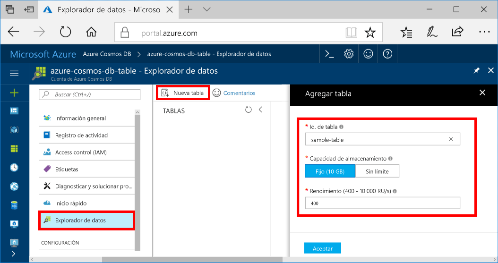
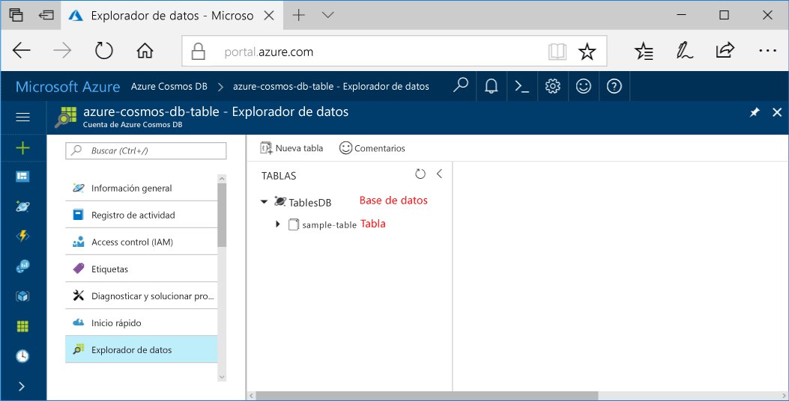

Ahora puede usar la herramienta Explorador de datos en Azure Portal para crear una base de datos y una tabla. 

1. Haga clic en **Explorador de datos** > **Nueva tabla**. 
    
    El área **Agregar tabla** se muestra en el extremo derecho, pero es posible que tenga que desplazarse hacia la derecha para verla.

    

2. En la página **Agregar tabla**, escriba la configuración de la nueva tabla.

    Configuración|Valor sugerido|Descripción
    ---|---|---
    Id. de tabla|sample-table|Identificador de la nueva tabla. Los nombres de tabla tienen los mismos requisitos de caracteres que los identificadores de base de datos. Los nombres de bases de datos deben tener entre 1 y 255 caracteres y no pueden contener `/ \ # ?` o un espacio al final.
    Capacidad de almacenamiento| Fija (10 GB)|Cambie el valor a **Fija (10 GB)**. Este valor corresponde a la capacidad de almacenamiento de la base de datos.
    Rendimiento|400 RU|Cambie el rendimiento a 400 unidades de solicitud por segundo (RU/s). Si quiere reducir la latencia, puede escalar verticalmente el rendimiento más adelante.

    Haga clic en **Aceptar**.

    El Explorador de datos muestra la nueva base de datos y la tabla.

    