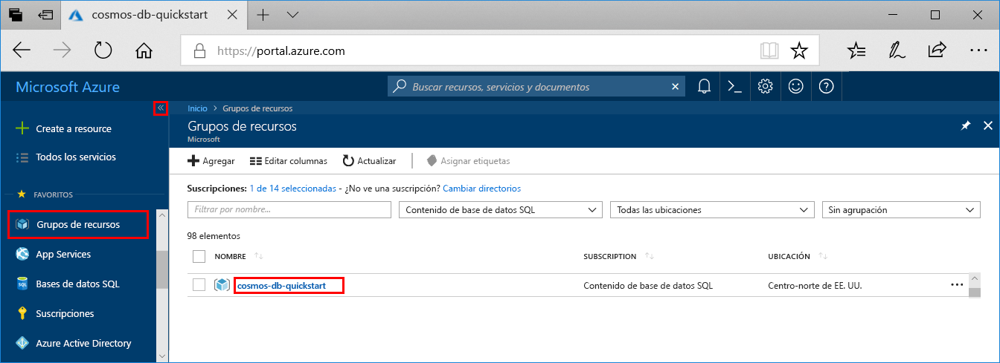

Si no va a seguir usando esta aplicación, siga estos pasos para eliminar todos los recursos creados en esta guía de inicio rápido a fin de que no se le apliquen cargos adicionales:

1. En Azure Portal, seleccione **Grupos de recursos** en el extremo izquierdo y luego seleccione el grupo de recursos que creó.  

    Si el menú izquierdo está contraído, haga clic en el  para expandirlo.

   

2. En la nueva ventana seleccione el grupo de recursos y luego haga clic en **Eliminar grupo de recursos**.

      

3. En la nueva ventana escriba el nombre del grupo de recursos que quiere eliminar y, después, haga clic en **Eliminar**.

