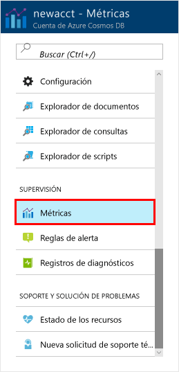
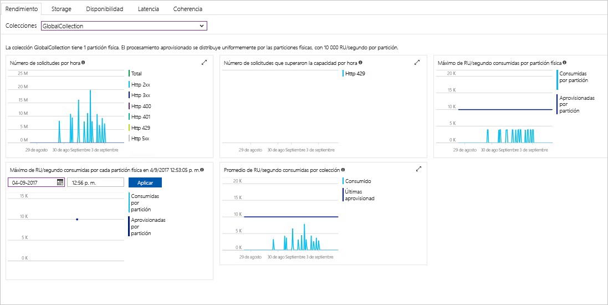

En Azure Portal se supervisan el rendimiento, el almacenamiento, la disponibilidad, la latencia y la coherencia de los recursos de su cuenta. Vamos a echar un vistazo rápido a estas métricas. 

1. Haga clic en **Métricas** en el menú de navegación.

   

2. Haga clic en cada una de las pestañas para hacerse una idea de las métricas que Azure Cosmos DB proporciona. 

    Todos los gráficos asociados a los [Acuerdos de Nivel de Servicio (SLA) de Azure Cosmos DB](https://azure.microsoft.com/support/legal/sla/cosmos-db/) contienen una línea que muestra si se ha violado alguno de ellos. Azure Cosmos DB hace que la supervisión de los Acuerdos de Nivel de Servicio sea transparente con este conjunto de métricas. 

   