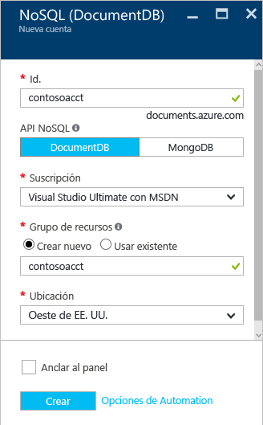
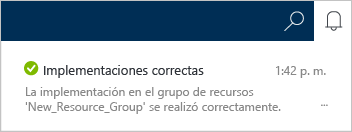
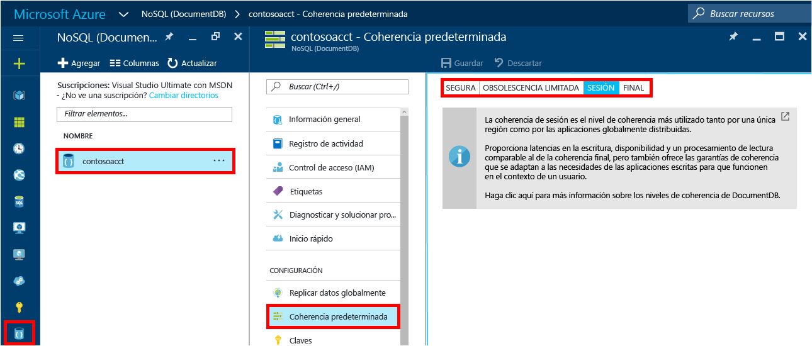

1. Inicie sesión en el [Portal de Azure](https://portal.azure.com/).
2. En la barra de salto, haga clic en **Nuevo**, en **Bases de datos** y en **NoSQL (DocumentDB)**.
   
     
3. En la hoja **Nueva cuenta** , especifique la configuración que desee para la cuenta de DocumentDB.
   
    
   
   * En el cuadro **Id.**, escriba un nombre para identificar la cuenta de DocumentDB.  Cuando se valida el **Id.**, aparece una marca de verificación verde en el cuadro **Id.**. El valor de **Id.** se convierte en el nombre de host dentro del URI. El **Id.** solo puede contener minúsculas, números y el carácter "-"; debe tener entre 3 y 50 caracteres. Tenga en cuenta que *documents.azure.com* se anexa al nombre del punto de conexión que elija, y su resultado se convierte en el punto de conexión de la cuenta de DocumentDB.
   * En el cuadro **NoSQL API**, seleccione **DocumentDB**.  
   * En **Suscripción**, seleccione la suscripción a Azure que desea usar para la cuenta de DocumentDB. Si la cuenta tiene una sola suscripción, se selecciona esa cuenta de manera predeterminada.
   * En **Grupo de recursos**, seleccione o cree un grupo de recursos para la cuenta de DocumentDB.  De forma predeterminada, se crea un grupo de recursos. Para más información, consulte el artículo sobre el [uso de Azure Portal para administrar los recursos de Azure](../articles/azure-portal/resource-group-portal.md).
   * Use **Ubicación** para especificar la ubicación geográfica en la que se hospedará la cuenta de DocumentDB. 
4. Una vez configuradas las opciones de la nueva cuenta de DocumentDB, haga clic en **Crear**. Para comprobar el estado de la implementación, consulte el centro de notificaciones.  
   
     
   
   
5. Después de crear la cuenta de DocumentDB, está listo para usarla con la configuración predeterminada. Para revisar la configuración predeterminada, haga clic en el icono **NoSQL (DocumentDB)** en la barra de salto, haga clic en la nueva cuenta y, después, haga clic en **Coherencia predeterminada** en el menú de recursos.

     

   La coherencia predeterminada de la cuenta de DocumentDB está establecida en **Sesión**.  Para ajustar la coherencia predeterminada, haga clic en **Coherencia predeterminada** en el menú de recursos. Para aprender más acerca de los niveles de coherencia que ofrece DocumentDB, consulte [Niveles de coherencia en DocumentDB](../articles/documentdb/documentdb-consistency-levels.md).

[How to: Create a DocumentDB account]: #Howto
[Next steps]: #NextSteps
[documentdb-manage]:../articles/documentdb/documentdb-manage.md

<!--HONumber=Dec16_HO2-->

