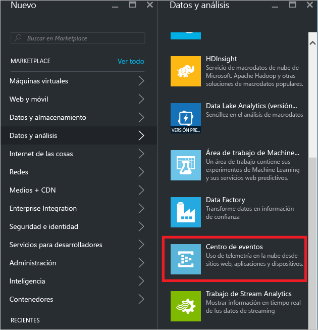
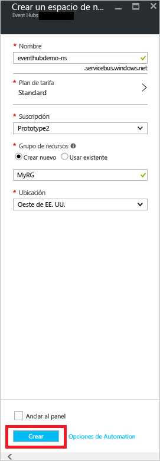
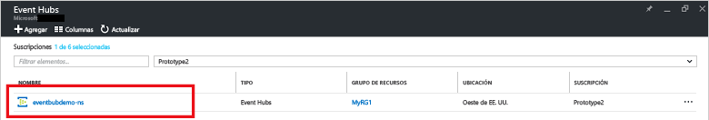
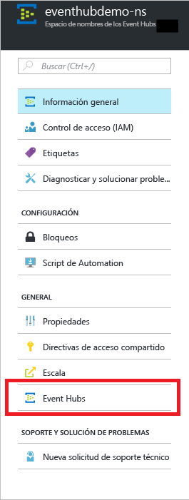
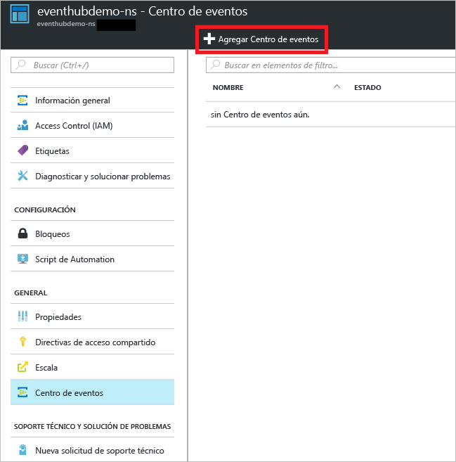
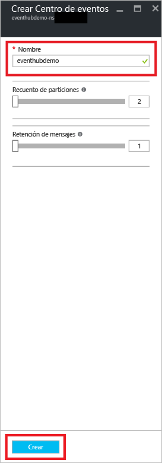
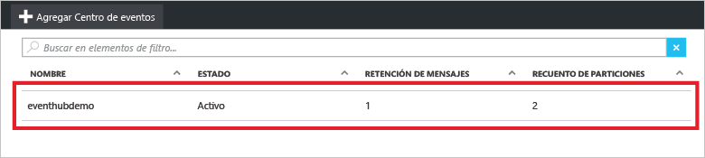
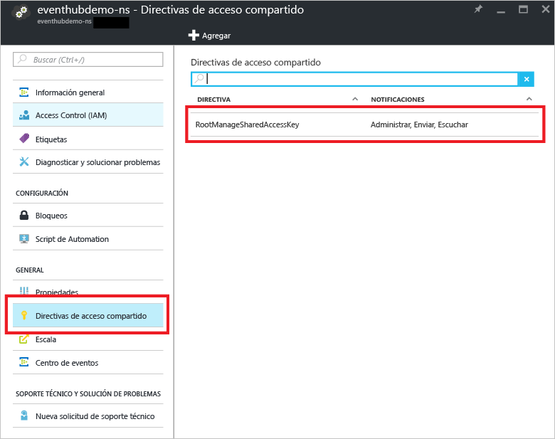
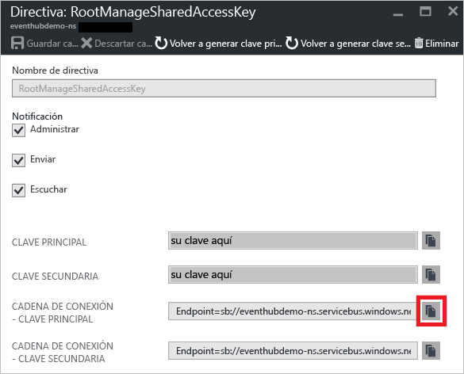

## Creación de un Centro de eventos
1. Inicie sesión en el [portal de Azure][portal de Azure] y, luego, haga clic en **Nuevo** en la parte superior izquierda de la pantalla.
2. Haga clic en **Datos y análisis** y, a continuación, en **Centros de eventos**.
   
    
3. En la hoja **Crear espacio de nombres**, especifique el nombre del espacio de nombres. El sistema realiza la comprobación automáticamente para ver si el nombre está disponible.
   
    
4. Después de asegurarse de que el nombre del espacio de nombres está disponible, elija el plan de tarifa (Básico o Estándar). Elija también una suscripción de Azure, un grupo de recursos y la ubicación en la que se va a crear el recurso.
5. Haga clic en **Crear** para crear el espacio de nombres.
6. En la lista de espacios de nombres de los Centros de eventos, haga clic en el espacio de nombres recién creado.
   
    
7. En la hoja del espacio de nombres, haga clic en **Centros de eventos**.
   
    
8. En la parte superior de la hoja, haga clic en **Agregar Centro de eventos**.
   
    
9. Escriba el nombre del Centro de eventos y, a continuación, haga clic en **Crear**.
   
    
10. En la lista de Centros de eventos, haga clic en el nombre del Centro de eventos recién creado.
    
     
11. En la hoja del espacio de nombres (no en la hoja del Centro de eventos específico), haga clic en **Directivas de acceso compartido** y, luego, en **RootManageSharedAccessKey**.
    
     
12. Haga clic en el botón Copiar para copiar la cadena de conexión **RootManageSharedAccessKey** al Portapapeles. Guarde esta cadena de conexión para usarla más adelante en el tutorial.
    
     

Ya se ha creado Centro de eventos y cuenta con las cadenas de conexión que necesita para enviar y recibir eventos. 

[portal de Azure]: https://portal.azure.com/

<!---HONumber=AcomDC_0921_2016-->