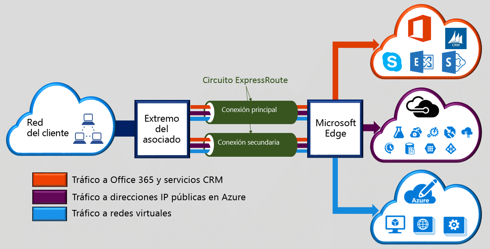

Microsoft Azure ExpressRoute le permite ampliar sus redes de local en la nube de Microsoft a través de una conexión privada y dedicada que facilita un proveedor de conectividad. Con ExpressRoute, se pueden establecer conexiones con servicios en la nube de Microsoft, como Microsoft Azure, Office 365 y CRM Online. La conectividad puede ser desde una red de conectividad universal (IP VPN), una red Ethernet de punto a punto, o una conexión cruzada virtual a través de un proveedor de conectividad en una instalación de ubicación compartida. Las conexiones ExpressRoute no pasan por la red pública de Internet. Esto permite a las conexiones de ExpressRoute ofrecer más confiabilidad, más velocidad, menor latencia y mayor seguridad que las conexiones normales a través de Internet.  

