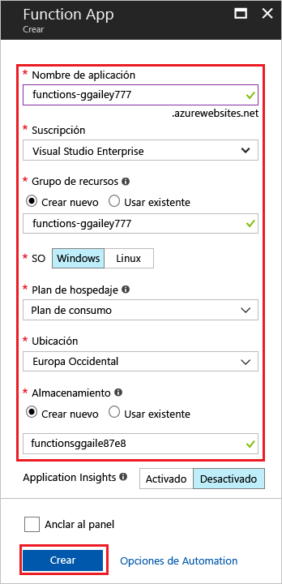

1. Haga clic en el botón **Nuevo** de la esquina superior izquierda de Azure Portal y seleccione **Proceso** > **Function App**. 

    

2. Use la configuración de Function App especificada en la tabla debajo de la imagen.

    

    | Configuración      | Valor sugerido  | Descripción                                        |
    | ------------ |  ------- | -------------------------------------------------- |
    | **Nombre de la aplicación** | Nombre único globalmente | Nombre que identifica la nueva Function App. Los caracteres válidos son `a-z`, `0-9` y `-`.  | 
    | **Suscripción** | Su suscripción | La suscripción en que se creará esta nueva aplicación de función. | 
    | **[Grupo de recursos](../articles/azure-resource-manager/resource-group-overview.md)** |  myResourceGroup | Nombre para el nuevo grupo de recursos en el que se va a crear la Function App. | 
    | **SISTEMA OPERATIVO** | Windows | El hospedaje sin servidor actualmente solo está disponible cuando se ejecuta en Windows. Para el hospedaje en Linux, consulte [Creación de su primera función para ejecutarse en Linux con la CLI de Azure (versión preliminar)](../articles/azure-functions/functions-create-first-azure-function-azure-cli-linux.md). |
    | **[Plan de hospedaje](../articles/azure-functions/functions-scale.md)** |   Plan de consumo | Plan de hospedaje que define cómo se asignan los recursos a la Function App. En el **Plan de consumo** predeterminado, los recursos se agregan dinámicamente según lo requieran sus funciones. En este hospedaje [sin servidor](https://azure.microsoft.com/overview/serverless-computing/), solo paga por el tiempo durante el cual se ejecutan las funciones.   |
    | **Ubicación** | Europa occidental | Elija una ubicación cerca de usted o cerca de otros servicios a los que tendrán acceso las funciones. |
    | **[Cuenta de almacenamiento](../articles/storage/common/storage-create-storage-account.md#create-a-storage-account)** |  Nombre único globalmente |  Nombre de la nueva cuenta de almacenamiento usada por Function App. Los nombres de cuentas de almacenamiento deben tener entre 3 y 24 caracteres, y solo pueden contener números y letras minúsculas. También puede usar una cuenta existente. |

1. Haga clic en **Crear** para aprovisionar e implementar la nueva función de aplicación.
