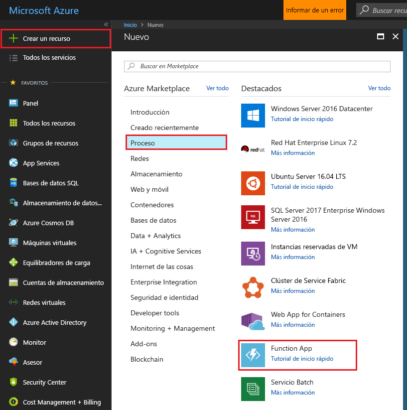

1. Haga clic en el botón **Nuevo** de la esquina superior izquierda de Azure Portal.

1. Haga clic en **Proceso** > **Function App** y seleccione su **suscripción**. Después, use la configuración de Function App especificada en la tabla.

    

    | Configuración      | Valor sugerido  | Descripción                                        |
    | ------------ |  ------- | -------------------------------------------------- |
    | **Nombre de la aplicación** | Nombre único globalmente | Nombre que identifica la nueva Function App. | 
    | **[Grupo de recursos](../articles/azure-resource-manager/resource-group-overview.md)** |  myResourceGroup | Nombre para el nuevo grupo de recursos en el que se va a crear la Function App. | 
    | **[Plan de hospedaje](../articles/azure-functions/functions-scale.md)** |   Plan de consumo | Plan de hospedaje que define cómo se asignan los recursos a la Function App. En el **Plan de consumo** predeterminado, los recursos se agregan dinámicamente según lo requieran sus funciones. Solo se paga por el tiempo durante el cual se ejecuten las funciones.   |
    | **Ubicación** | Europa occidental | Elija una ubicación cerca de usted o cerca de otros servicios a los que tendrán acceso las funciones. |
    | **[Cuenta de almacenamiento](../articles/storage/common/storage-create-storage-account.md#create-a-storage-account)** |  Nombre único globalmente |  Nombre de la nueva cuenta de almacenamiento usada por Function App. Los nombres de cuentas de almacenamiento deben tener entre 3 y 24 caracteres, y solo pueden contener números y letras minúsculas. También puede usar una cuenta existente. |

1. Haga clic en **Crear** para aprovisionar e implementar la nueva función de aplicación.