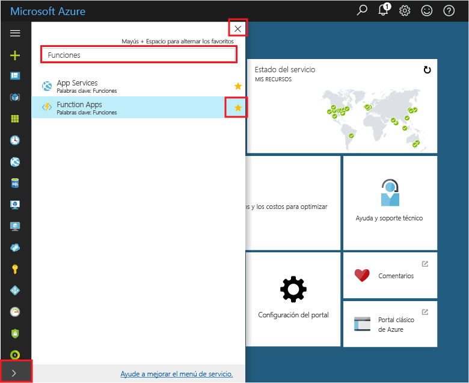
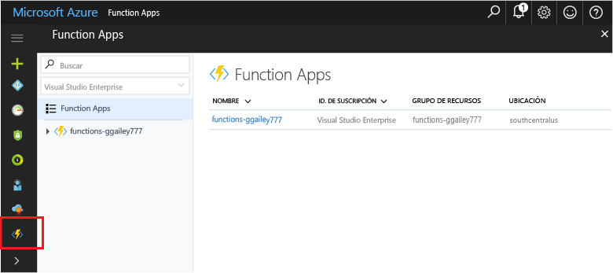

## Agregar instancias de Function App a los favoritos de su portal 

Si todavía no lo ha hecho, agregue instancias de Function App a sus favoritos en Azure Portal. Esto facilita la búsqueda de las instancias de Function App. Si ya lo ha hecho, vaya a la sección siguiente. 

1. Inicie sesión en el [Portal de Azure](https://portal.azure.com/).

2. Haga clic en la flecha en la parte inferior izquierda para ampliar todos los servicios, escriba `Functions` en el campo **Filtro** y, después, haga clic en la estrella junto a **Instancias de Function App**.  
 
    

    Esto agrega el icono Funciones al menú de la izquierda del portal.

3. Cierre el menú y después desplácese hasta la parte inferior para ver el icono Funciones. Haga clic en este icono para ver una lista de todas sus instancias de Function App. Haga clic en su Function App para trabajar con las funciones de esta aplicación. 
 
    
 
     