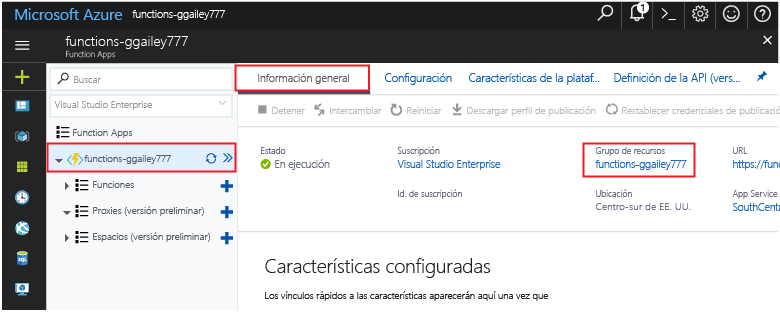

Otras guías de inicio rápido de esta colección se basan en los valores de esta. Si tiene previsto seguir trabajando con las siguientes guías de inicio rápido o tutoriales, no elimine los recursos creados en esta guía de inicio rápido. 

Si no planea continuar, haga clic en el **Grupo de recursos** para la Function App del portal y, después, haga clic en **Eliminar**. 

