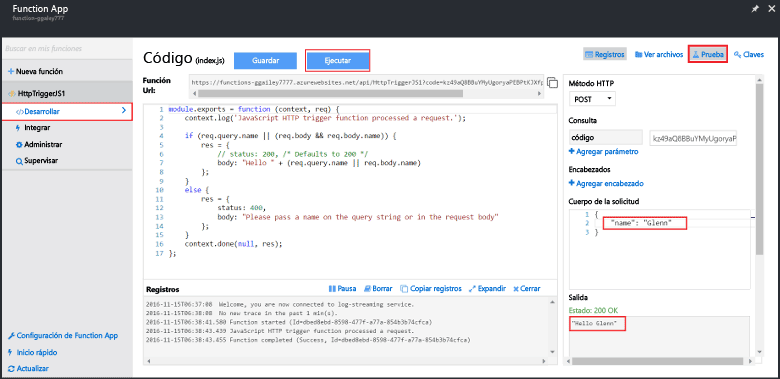

Puesto que los inicios rápidos de Azure Functions contienen código funcional, puede probar la nueva función inmediatamente.

1. En la pestaña **Desarrollar**, revise la ventana **Código** y observe que este código Node.js espera una solicitud HTTP con un valor de *nombre* pasado en el cuerpo del mensaje o en una cadena de consulta. Cuando se ejecuta la función, este valor se devuelve en el mensaje de respuesta.
   
2. Haga clic en **Probar** para mostrar el panel de solicitud de prueba HTTP integrado para la función.
 
    

3. En el cuadro de texto **Cuerpo de la solicitud**, cambie el valor de la propiedad *name* a su nombre y haga clic en **Ejecutar**. Se ve que la ejecución la desencadena una solicitud HTTP de prueba, la información se escribe en los registros y la respuesta "hello" se muestra en **Salida**. 

4. Para desencadenar la ejecución de la misma función desde una herramienta de prueba de HTTP o desde otra ventana del explorador, copie el valor de **URL de función** de la pestaña **Desarrollar** y péguelo en la barra de direcciones de la herramientas de la herramienta o del explorador. Agregue el valor de la cadena de consulta `&name=yourname` a la dirección URL y ejecute la solicitud. Tenga en cuenta que la misma información se escribe en los registros y que la misma cadena se encuentra en el cuerpo del mensaje de respuesta.

    

<!--HONumber=Feb17_HO1-->

