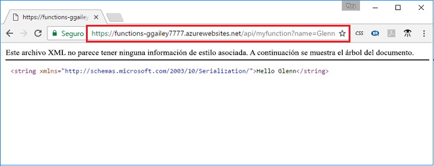

## <a name="test"></a>Prueba de la función

Use cURL para probar la función implementada en un equipo Mac o Linux o use Bash en Windows. Ejecute el siguiente comando cURL, reemplazando el marcador de posición `<app_name>` por el nombre de su Function App. Anexe la cadena de consulta `&name=<yourname>` a la dirección URL.

```bash
curl http://<app_name>.azurewebsites.net/api/HttpTriggerJS1?name=<yourname>
```  

  

Si no tiene cURL disponible en su línea de comandos, escriba la misma dirección URL en la dirección de su explorador web. De nuevo, reemplace el marcador de posición `<app_name>` por el nombre de su Function App, anexe la cadena de consulta `&name=<yourname>` a la dirección URL y ejecute la solicitud. 

    http://<app_name>.azurewebsites.net/api/HttpTriggerJS1?name=<yourname>
   
  
