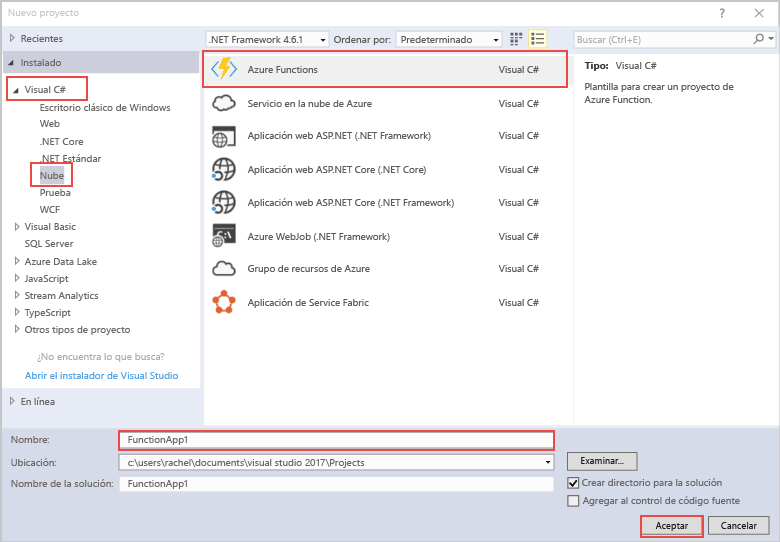

La plantilla del proyecto de Azure Functions de Visual Studio crea un proyecto que se puede publicar en una aplicación de función en Azure. Una Function App permite agrupar funciones como una unidad lógica para facilitar la administración, la implementación y el uso compartido de recursos.   

1. Haga clic con el botón derecho del ratón en el nodo del proyecto en el **Explorador de soluciones** y, después, elija **Agregar** > **Nuevo elemento**. Elija **Función de Azure** en el cuadro de diálogo.

2. En el cuadro de diálogo **Nuevo proyecto**, expanda el nodo **Visual C#** > **Nube**, seleccione **Azure Functions**, escriba el **nombre** del proyecto y haga clic en **Aceptar**. El nombre de la aplicación de función debe ser válido como espacio de nombres de C#, por lo que no debe usar guiones bajos, guiones u otros caracteres no alfanuméricos. 

    