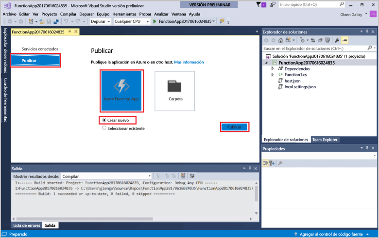
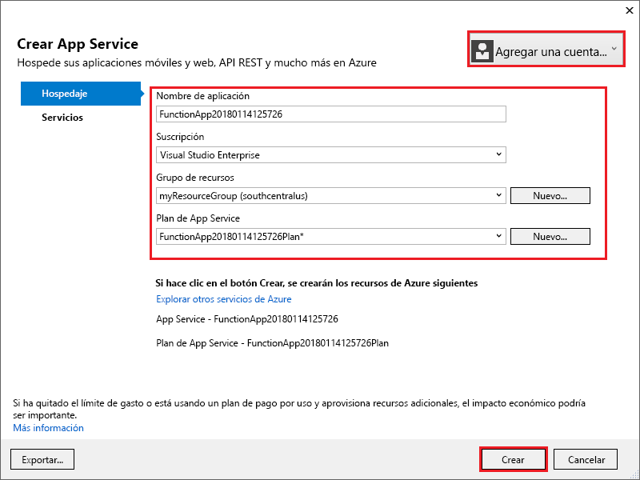
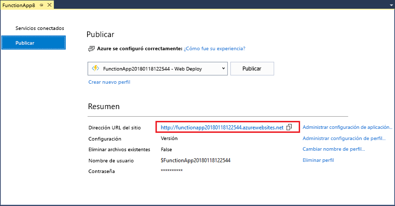

En el **Explorador de soluciones**, haga clic con el botón derecho en el proyecto y seleccione **Publicar**. Elija **Crear nuevo** y, después, haga clic en **Publicar**. 

Si Visual Studio no está ya conectado a su cuenta de Azure, haga clic en **Agregar una cuenta...** .  

En el cuadro de diálogo **Crear servicio de aplicaciones**, utilice la configuración de hospedaje que se especifica en la tabla. 

| Configuración      | Valor sugerido  | Descripción                                |
| ------------ |  ------- | -------------------------------------------------- |
| **Nombre de aplicación** | Nombre único globalmente | Nombre que identifica de forma única la nueva aplicación de función. |
| **Suscripción** | Elija una suscripción | La suscripción de Azure que se va a usar. |
| **[Grupo de recursos](../articles/azure-resource-manager/resource-group-overview.md)** | myResourceGroup |  Nombre del grupo de recursos en el que se va a crear la aplicación de función. |
| **[Plan de App Service](../articles/azure-functions/functions-scale.md)** | Plan de consumo | Asegúrese de que elige **Consumo** en **Tamaño** al crea un plan nuevo.  |
| **[Cuenta de almacenamiento](../articles/storage/storage-create-storage-account.md#create-a-storage-account)** | Nombre único globalmente | Use una cuenta de almacenamiento existente o crear una nueva.   |

Haga clic en **Crear** para crear una aplicación de función en Azure con esta configuración. Una vez finalizado el aprovisionamiento, anote el valor de **URL del sitio**, que es la dirección de la aplicación de la función en Azure. 

