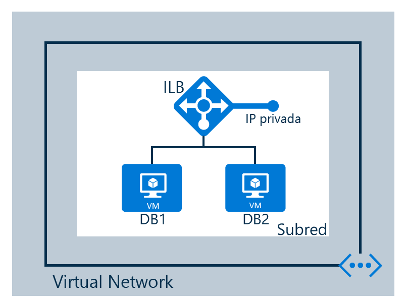

## Escenario de configuración

En este escenario, se va a crear un equilibrador de carga interno en una red virtual, como se muestra en la ilustración siguiente:

Esta es la configuración de nuestro escenario:

* Dos máquinas virtuales denominadas **DB1** y **DB2**
* Puntos de conexión para el equilibrador de carga interno
* Un equilibrador de carga interno
