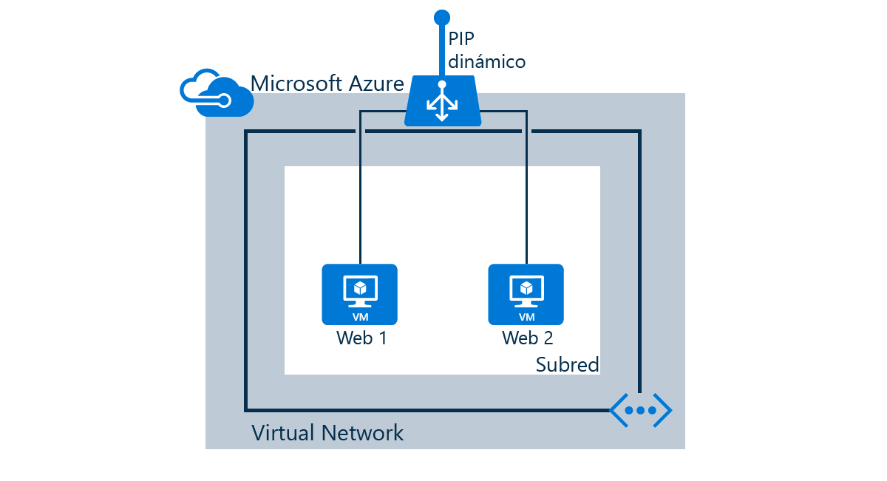

En este escenario se realizarán las siguientes tareas:

* Crear un equilibrador de carga que reciba tráfico de red en el puerto 80 y envíe tráfico de carga equilibrada a las máquinas virtuales "web1" y "web2".
* Crear reglas NAT para el acceso de escritorio remoto / SSH para máquinas virtuales detrás del equilibrador de carga
* Crear sondeos de estado

<!--HONumber=Nov16_HO2-->

