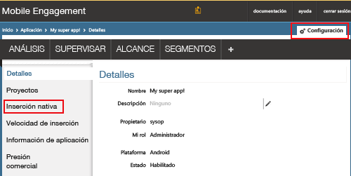
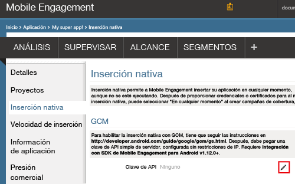
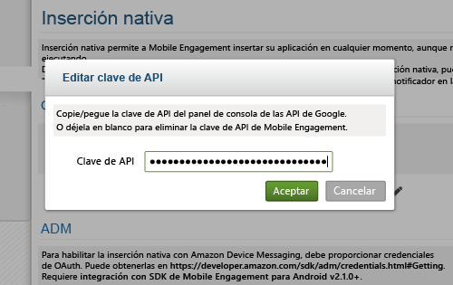
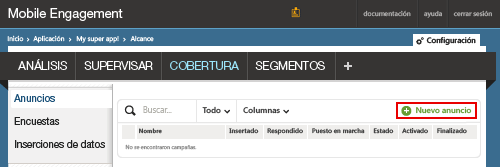
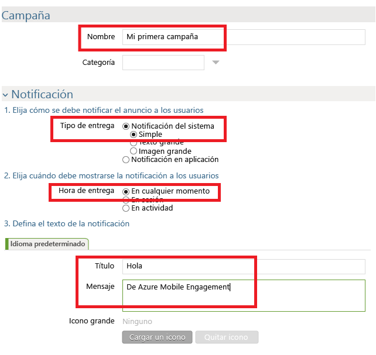
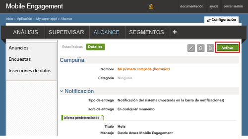

### Conceder acceso de Mobile Engagement a la clave de API de GCM

Para permitir que Mobile Engagement envíe notificaciones de inserción en su nombre, deberá conceder acceso a la clave de API. Esto se hace configurando y escribiendo la clave en el portal de Mobile Engagement.

1. En Azure Portal, asegúrese de que se encuentra en la aplicación que estamos usando para este proyecto y luego haga clic en el botón **Interactuar** en la parte inferior:

    

2. A continuación, haga clic en **Configuración** -> **Inserción nativa** para acceder a la clave GCM:

    

3. Haga clic en el icono **Editar** delante de **Clave de API**, en la sección **Configuración de GCM**, tal y como se muestra a continuación:

    

4. En el menú emergente, pegue la clave del servidor de GCM obtenida antes y, a continuación, haga clic en **Aceptar**.

    

## Enviar una notificación a su aplicación

Ahora crearemos una campaña de notificación de inserción simple que enviará una notificación de inserción a nuestra aplicación.

1. Vaya a la pestaña **COBERTURA** en el portal de Mobile Engagement.

2. Haga clic en **Nuevo anuncio** para crear la campaña de notificaciones de inserción.

    
3. Configure el primer campo de la campaña mediante los pasos siguientes:

    

    a. Asigne un nombre a la campaña.

    b. Seleccione el **Tipo de entrega** como *Notificación del sistema -> Simple*: este es el tipo de notificación push simple de Android que incluye un título y una pequeña línea de texto.

    c. En **Tiempo de entrega** , seleccione *Cualquier momento* para permitir que la aplicación reciba una notificación, independientemente de si se ha iniciado o no.

    d. En el texto de la notificación, escriba el **título** que aparecerá en negrita en la inserción.

    e. Luego escriba su **mensaje**
4. Desplácese hacia abajo y en la sección **Contenido**, seleccione **Solo notificación**.

    
5. Ya ha terminado de configurar la campaña más básica posible. Ahora, desplácese de nuevo hacia abajo y haga clic en el botón **Crear** para guardar la campaña.
6. Último paso: haga clic en **Activar** para activar su campaña y enviar notificaciones push.
   
    

