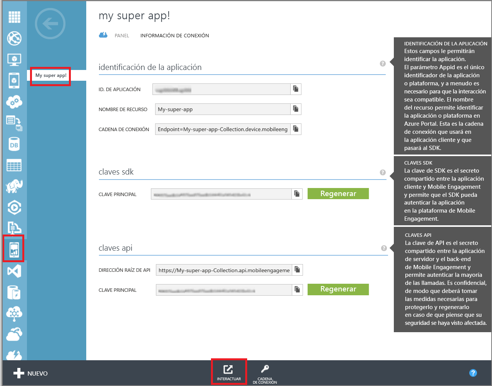
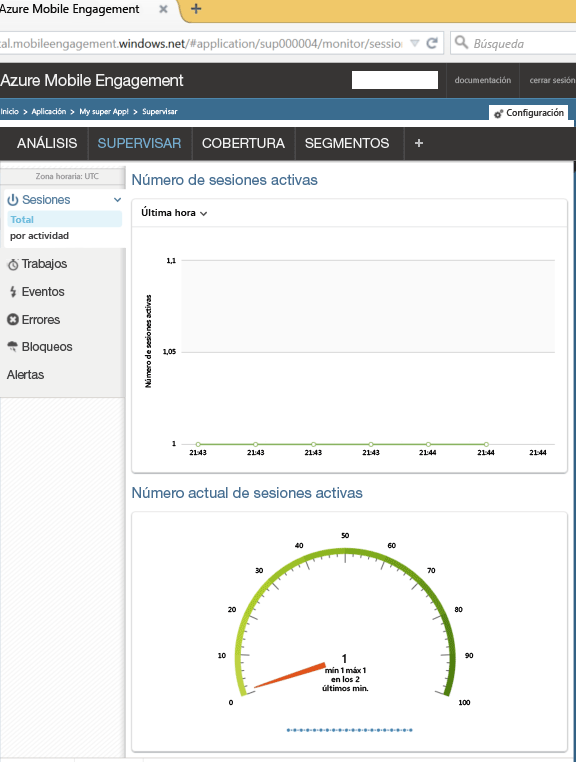

En esta sección se muestra cómo asegurarse de que la aplicación se conecta al back-end de Mobile Engagement mediante la característica de supervisión en tiempo real de Mobile Engagement.

1. Desplácese hasta el portal de Mobile Engagement. Asegúrese de que se encuentra en la aplicación que estamos usando para este proyecto y luego haga clic en el botón **Interactuar** de la parte inferior.

	 

2. Entrará en el portal de Mobile Engagement. Haga clic en la pestaña **Monitor**.
	 
	

3. El monitor está listo para mostrar en tiempo real cualquier dispositivo que iniciará su aplicación.
	 
4. Inicie su aplicación en el emulador/simulador o en un dispositivo conectado. Debería ver una sesión en el monitor si su integración es correcta, lo que significa que la aplicación está ahora conectada al back-end de Mobile Engagement y le está enviando datos.
	
	 

<!---HONumber=Oct15_HO1-->