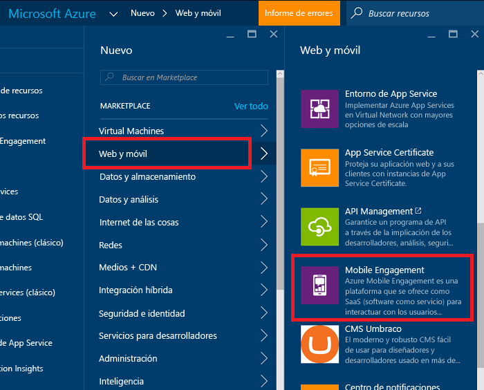
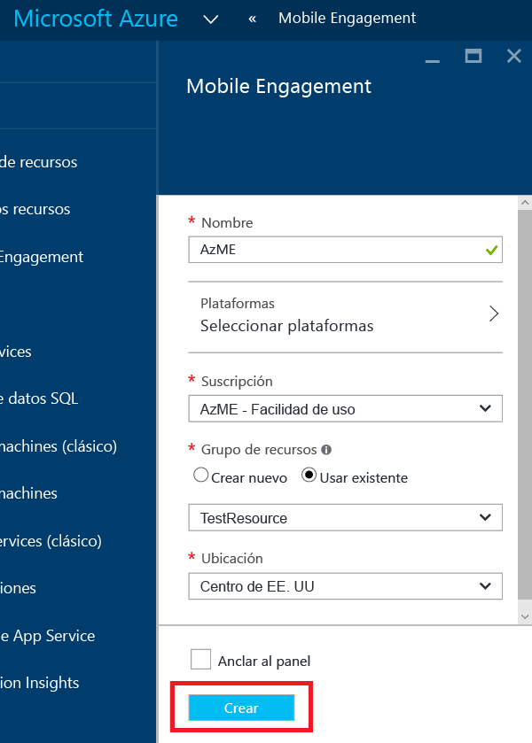
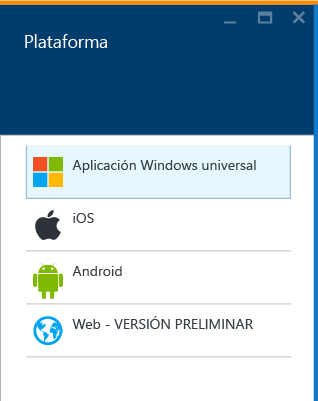
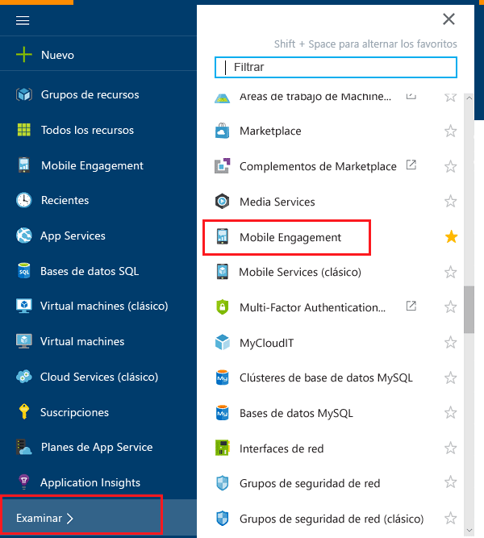
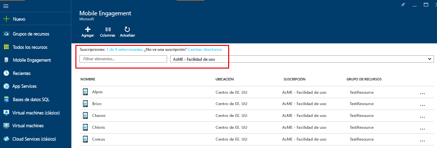
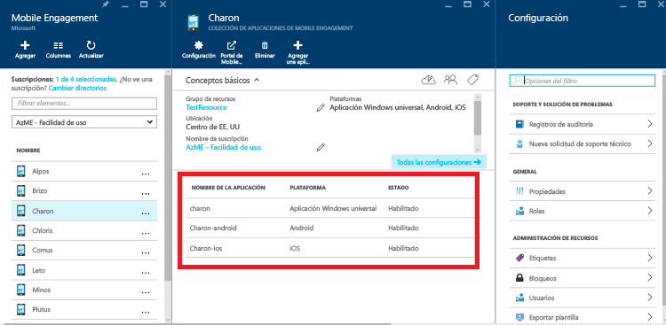
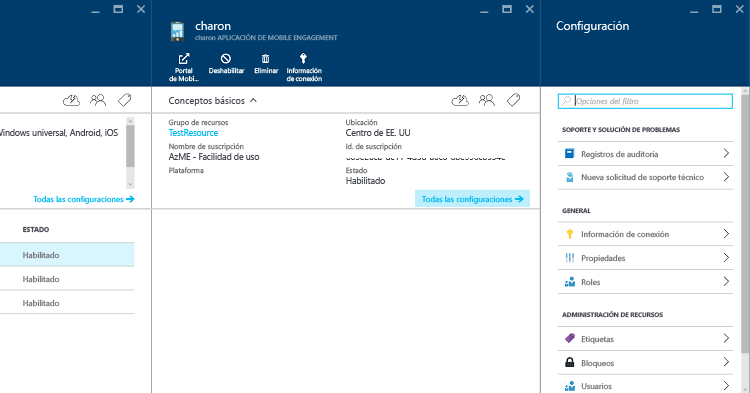

1. Inicie sesión en [Azure Portal](https://portal.azure.com).
2. Haga clic en **Nueva**, luego en **Web y móvil** y, finalmente, en **Mobile Engagement**.
   
    
3. En la hoja **Nueva colección de aplicaciones de Mobile Engagement** que aparece, va a crear una colección de aplicaciones. Escriba la siguiente información:
   
    
   
   * **Nombre**: Nombre of your *colección de aplicaciones* 
   * **Plataformas**: seleccione las plataformas de destino para la aplicación en la hoja Plataformas que se abrirá. Por ejemplo, si desea una aplicación tanto para iOS como para Android, seleccione ambas plataformas y obtendrá dos aplicaciones creadas en esta colección de aplicaciones. 
     
      
   * **Suscripción**: seleccione la suscripción de Azure. 
   * **Grupo de recursos**: seleccione el grupo de recursos de Azure en el que desea este recurso de Azure (colección de aplicaciones de Mobile Engagement). Puede elegir crear uno nuevo.  
   * **Ubicación**: la región en que se almacenarán los datos acerca de esta colección de aplicaciones y la aplicación.
4. Explore las colecciones de aplicaciones de Mobile Engagement haciendo clic **Examinar** y busque **Mobile Engagement**.
   
    
5. Se mostrará una lista de colecciones de aplicaciones de Mobile Engagement (asegúrese de que tiene la misma suscripción de Azure en la que creó la colección de aplicaciones).
   
    
6. Haga clic en la colección de aplicaciones que creó en el paso anterior para abrir la hoja de recursos de la colección de aplicaciones, que le mostrará las distintas aplicaciones presentes en esta colección de aplicaciones. 
   
    
7. Haga clic en la aplicación que creó para la plataforma que está desarrollando. 
   
    
8. Haga clic en el botón de comando **Información de conexión** en la parte superior para abrir la hoja Información de conexión y copie la cadena de conexión de ahí. 
   
    

