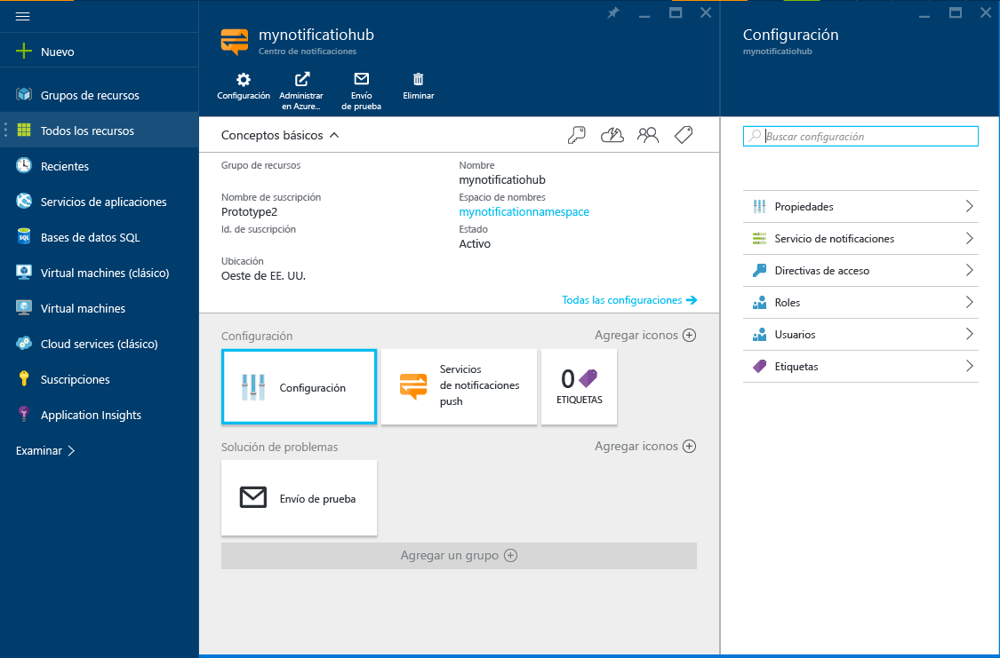

1. Inicie sesión en el [Portal de Azure](https://portal.azure.com).

2. Seleccione **Nuevo** > **Web y móvil** > **Centro de notificaciones**.
   
      
      
3. En el cuadro **Centro de notificaciones**, escriba un nombre único. Seleccione el elemento **Región**, **Suscripción** y **Grupo de recursos** (si dispone ya de uno). 
   
    Si ya tiene un espacio de nombres de Service Bus donde crear el centro, haga lo siguiente:

    a. En el área **Espacio de nombres**, seleccione el vínculo **Seleccionar uno existente**. 
   
    b. Seleccione **Crear**.

    Si aún no tiene un espacio de nombres de Service Bus, puede usar el predeterminado, que se crea en función del nombre del centro (si está disponible el espacio de nombres).
   
      

    Después de haber creado el centro de notificaciones y el espacio de nombres, Azure Portal se abre. 
   
      

4. Seleccione **Configuración** > **Directivas de acceso**. Anote las dos cadenas de conexión disponibles. Las necesitará para gestionar las notificaciones push más tarde.
   
      

