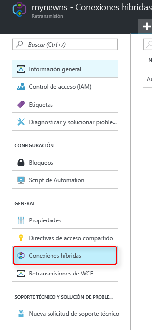
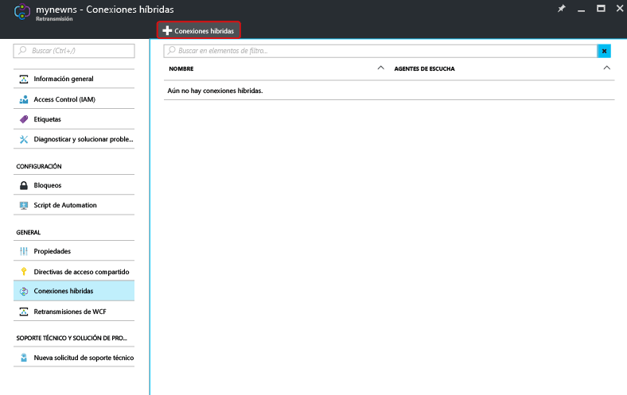
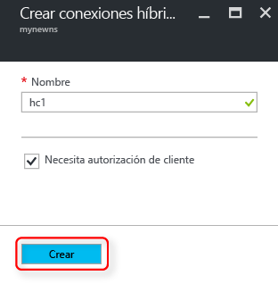

Asegúrese de haber [creado un espacio de nombres de Relay][namespace-how-to].

1. Inicie sesión en el [Azure Portal](https://portal.azure.com).
2. En el menú izquierdo, seleccione **Todos los recursos**.
3. Seleccione el espacio de nombres en el que quiere crear la conexión híbrida. En este caso, es **mynewns**.  
4. En **Relay namespace** (Espacio de nombres de Relay), seleccione **Conexiones híbridas**.

    

5. En la ventana de información general del espacio de nombres, haga clic en **+ Hybrid Connection** (+ Conexión híbrida).
   
    
6. En **Crear conexión híbrida**, escriba un valor para el nombre de la conexión híbrida. Deje los demás valores predeterminados.
   
    
7. Seleccione **Crear**.

[namespace-how-to]: ../articles/service-bus-relay/relay-create-namespace-portal.md 