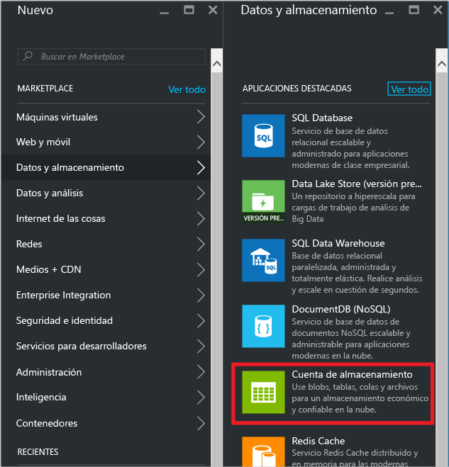
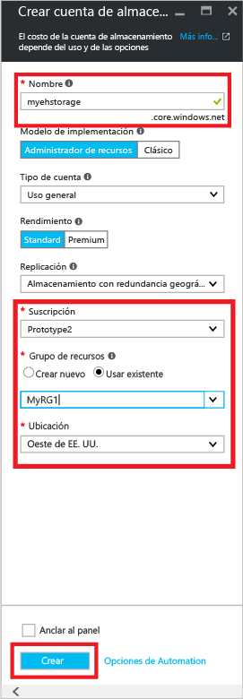
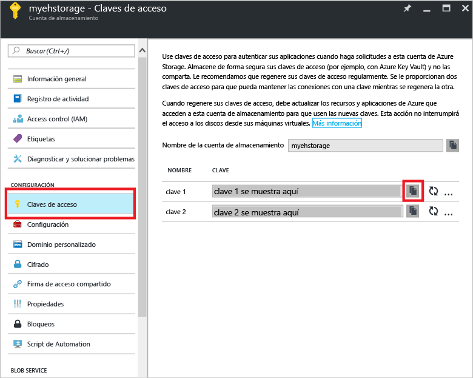
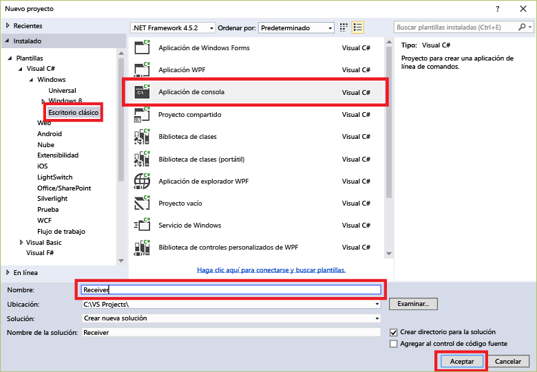
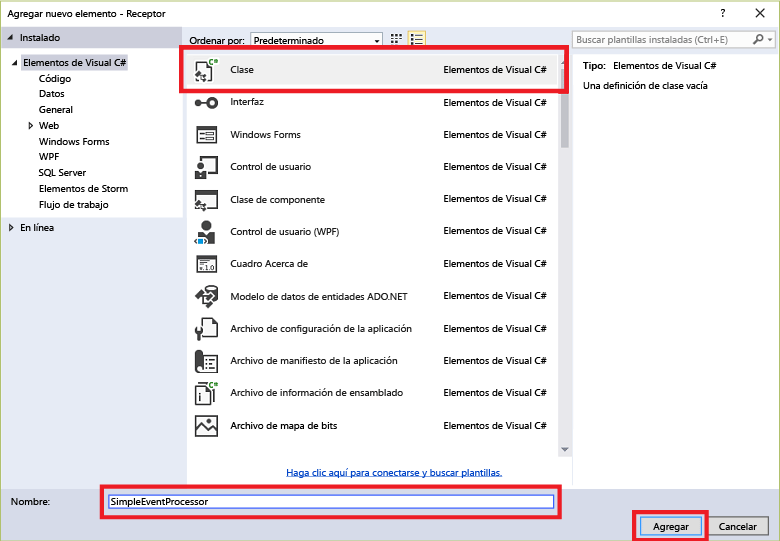

## Recepción de mensajes con EventProcessorHost

[EventProcessorHost][] es una clase de .NET que simplifica la recepción de eventos desde los Centros de eventos mediante la administración de puntos de control persistentes y recepciones paralelas desde tales Centros de eventos. Con [EventProcessorHost][], puede dividir eventos entre varios destinatarios, incluso cuando están hospedados en distintos nodos. Este ejemplo muestra cómo usar [EventProcessorHost][] para un solo destinatario. El ejemplo de [procesamiento de eventos escalados horizontalmente][] muestra cómo usar [EventProcessorHost][] con varios destinatarios.

Para poder usar [EventProcessorHost][], debe tener una [cuenta de almacenamiento de Azure][]\:

1. Inicie sesión en el [portal de Azure][] y, luego, haga clic en **Nuevo** en la parte superior izquierda de la pantalla.

2. Haga clic en **Datos y almacenamiento** y luego en **Cuenta de almacenamiento**.

    

3. En la hoja **Crear cuenta de almacenamiento**, escriba un nombre para la cuenta de almacenamiento. Elija una suscripción de Azure, el grupo de recursos y la ubicación en la que se va a crear el recurso. A continuación, haga clic en **Crear**.

    

4. En la lista de cuentas de almacenamiento, haga clic en la cuenta de almacenamiento recién creada.

5. En la hoja de la cuenta de almacenamiento, haga clic en **Claves de acceso**. Copie el valor de **key1** para usarla más adelante en este tutorial.

	

4. En Visual Studio, cree un nuevo proyecto de aplicación de escritorio de Visual C# con la plantilla de proyecto **Aplicación de consola**. Asigne al proyecto el nombre **Receptor**.

    

5. En el Explorador de soluciones, haga clic con el botón derecho en la solución y luego haga clic en **Administrar paquetes NuGet para la solución**.

6. Haga clic en la pestaña **Examinar** y, después, busque `Microsoft Azure Service Bus Event Hub - EventProcessorHost`. Asegúrese de que el nombre del proyecto (**Receiver**) se especifica en el cuadro **Versiones**. Haga clic en **Instalar** y acepte las condiciones de uso.

    

	Visual Studio descarga, instala y agrega una referencia al [Centro de eventos del Bus de servicio de Azure - Paquete de NuGet de EventProcessorHost](https://www.nuget.org/packages/Microsoft.Azure.ServiceBus.EventProcessorHost), con todas sus dependencias.

7. Haga clic con el botón derecho en el proyecto **Receptor**, haga clic en **Agregar** y, a continuación, haga clic en **Clase**. Asigne a la nueva clase el nombre **SimpleEventProcessor** y después haga clic en **Agregar** para crear la clase.

	

8. Agregue las siguientes instrucciones en la parte superior del archivo SimpleEventProcessor.cs:

	```
	using Microsoft.ServiceBus.Messaging;
	using System.Diagnostics;
	```

	A continuación, sustituya el código siguiente por el cuerpo de la clase:

	```
    class SimpleEventProcessor : IEventProcessor
	{
	    Stopwatch checkpointStopWatch;

	    async Task IEventProcessor.CloseAsync(PartitionContext context, CloseReason reason)
	    {
	        Console.WriteLine("Processor Shutting Down. Partition '{0}', Reason: '{1}'.", context.Lease.PartitionId, reason);
	        if (reason == CloseReason.Shutdown)
	        {
	            await context.CheckpointAsync();
	        }
	    }

	    Task IEventProcessor.OpenAsync(PartitionContext context)
	    {
	        Console.WriteLine("SimpleEventProcessor initialized.  Partition: '{0}', Offset: '{1}'", context.Lease.PartitionId, context.Lease.Offset);
	        this.checkpointStopWatch = new Stopwatch();
	        this.checkpointStopWatch.Start();
	        return Task.FromResult<object>(null);
	    }

	    async Task IEventProcessor.ProcessEventsAsync(PartitionContext context, IEnumerable<EventData> messages)
	    {
	        foreach (EventData eventData in messages)
	        {
	            string data = Encoding.UTF8.GetString(eventData.GetBytes());

	            Console.WriteLine(string.Format("Message received.  Partition: '{0}', Data: '{1}'",
	                context.Lease.PartitionId, data));
	        }

	        //Call checkpoint every 5 minutes, so that worker can resume processing from 5 minutes back if it restarts.
	        if (this.checkpointStopWatch.Elapsed > TimeSpan.FromMinutes(5))
            {
                await context.CheckpointAsync();
                this.checkpointStopWatch.Restart();
            }
	    }
	}
    ```

	**EventProcessorHost** llamará a esta clase para procesar los eventos recibidos del Centro de eventos. Tenga en cuenta que la clase `SimpleEventProcessor` usa un cronómetro para llamar periódicamente al método de punto de control en el contexto **EventProcessorHost**. Esto garantiza que, si se reinicia el destinatario, no perderá más de cinco minutos de trabajo de procesamiento.

9. En la clase **Program.cs**, agregue la siguiente instrucción `using` al principio del archivo:

	```
	using Microsoft.ServiceBus.Messaging;
	```

	Después, reemplace el método `Main` de la clase `Program` con el código siguiente, sustituyendo el nombre del Centro de eventos y la cadena de conexión de nivel del espacio de nombres que ha guardado anteriormente, y la cuenta de almacenamiento y la clave que ha copiado en las secciones anteriores.

    ```
	static void Main(string[] args)
    {
      string eventHubConnectionString = "{Event Hub connection string}";
      string eventHubName = "{Event Hub name}";
      string storageAccountName = "{storage account name}";
      string storageAccountKey = "{storage account key}";
      string storageConnectionString = string.Format("DefaultEndpointsProtocol=https;AccountName={0};AccountKey={1}", storageAccountName, storageAccountKey);

      string eventProcessorHostName = Guid.NewGuid().ToString();
      EventProcessorHost eventProcessorHost = new EventProcessorHost(eventProcessorHostName, eventHubName, EventHubConsumerGroup.DefaultGroupName, eventHubConnectionString, storageConnectionString);
      Console.WriteLine("Registering EventProcessor...");
      var options = new EventProcessorOptions();
      options.ExceptionReceived += (sender, e) => { Console.WriteLine(e.Exception); };
      eventProcessorHost.RegisterEventProcessorAsync<SimpleEventProcessor>(options).Wait();

      Console.WriteLine("Receiving. Press enter key to stop worker.");
      Console.ReadLine();
      eventProcessorHost.UnregisterEventProcessorAsync().Wait();
    }
	```

> [AZURE.NOTE] Este tutorial usa una sola instancia de [EventProcessorHost][]. Para aumentar el rendimiento, se recomienda ejecutar varias instancias de [EventProcessorHost][], como se muestra en el ejemplo de [procesamiento de eventos escalados horizontalmente][]. En esos casos, las diferentes instancias se coordinan automáticamente entre sí con el fin de equilibrar la carga de los eventos recibidos. Si desea que varios destinatarios procesen *todos* los eventos, debe usar el concepto **ConsumerGroup**. Cuando se reciben eventos de distintos equipos, puede ser útil especificar nombres para las instancias de [EventProcessorHost][] según los equipos (o roles) en que se implementan. Para más información acerca de estos temas, consulte [Información general de los Centros de eventos][] y [Guía de programación de Centros de eventos][].

<!-- Links -->
[Información general de los Centros de eventos]: event-hubs-overview.md
[Guía de programación de Centros de eventos]: event-hubs-programming-guide.md
[procesamiento de eventos escalados horizontalmente]: https://code.msdn.microsoft.com/Service-Bus-Event-Hub-45f43fc3
[cuenta de almacenamiento de Azure]: ../storage/storage-create-storage-account.md
[EventProcessorHost]: http://msdn.microsoft.com/library/azure/microsoft.servicebus.messaging.eventprocessorhost(v=azure.95).aspx
[portal de Azure]: https://portal.azure.com

<!---HONumber=AcomDC_0921_2016-->