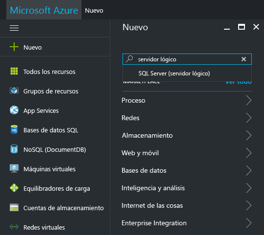
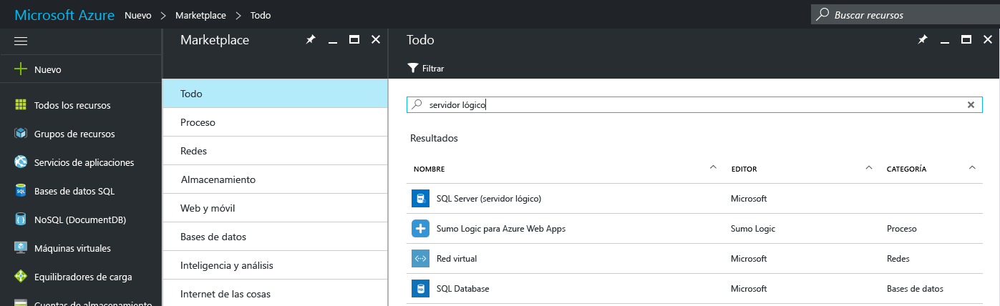
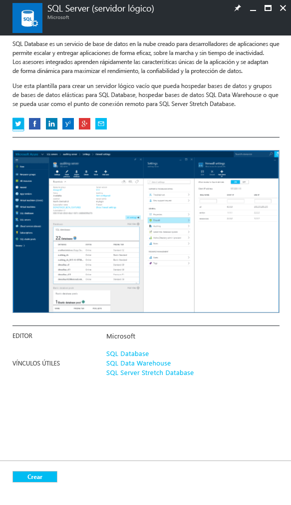
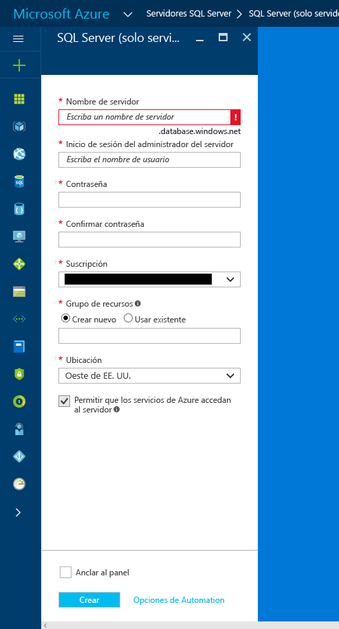
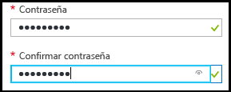
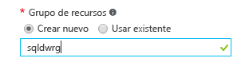

### Creación un nuevo servidor SQL lógico en Azure Portal

1. Haga clic en **Nuevo**, busque **servidor lógico**y, a continuación, pulse **ENTRAR**.

    
2. Seleccione **SQL Server (servidor lógico)** 

    
  
3. Haga clic en **Crear** para abrir la nueva hoja SQL Server (servidor lógico).

   <kbd> </kbd> <kbd> </kbd>
  
3. En la hoja SQL Server (servidor lógico), en el cuadro de texto Nombre de servidor, proporcione un nombre válido para el nuevo servidor lógico. Una marca de verificación verde indica que ha proporcionado un nombre válido.
    
    

    > [!IMPORTANT]
    > El nombre completo del nuevo servidor será <nombreDeSuServidor >.database.windows.net.
    >
    
4. En el cuadro de texto de inicio de sesión del administrador del servidor, proporcione un nombre de usuario para el inicio de sesión de autenticación de SQL para este servidor. Este inicio de sesión se conoce como el inicio de sesión de la entidad de seguridad del servidor. Una marca de verificación verde indica que ha proporcionado un nombre válido.
    
    
5. En los cuadros de texto **Contraseña** y **Confirmar contraseña**, escriba una contraseña para la cuenta de inicio de sesión de la entidad de seguridad del servidor. Una marca de verificación verde indica que ha proporcionado una contraseña válida.
    
    
6. Seleccione una suscripción en la que tenga permiso para crear objetos.

    
7. En el cuadro de texto Grupo de recursos, seleccione **Crear nuevo** y, en el cuadro de texto del grupo de recursos, proporcione un nombre válido para el nuevo grupo de recursos (también puede usar un grupo de recursos existente si ya ha creado uno para sí mismo). Una marca de verificación verde indica que ha proporcionado un nombre válido.

    

8. En el cuadro de texto **Ubicación**, seleccione un centro de datos adecuado para su ubicación; por ejemplo, "Este de Australia".
    
    
    
    > [!TIP]
    > La casilla de verificación **Permitir que los servicios de Azure accedan al servidor** no se puede cambiar en esta hoja. Puede cambiar esta configuración en la hoja del firewall del servidor. Para más información, consulte [Get started with security](../articles/sql-database/sql-database-manage-servers-portal.md) (Introducción a la seguridad).
    >
    
9. Haga clic en **Crear**.

    

