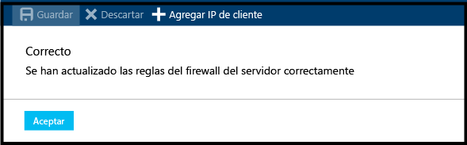

### Creación de una regla de firewall de nivel a servidor en Azure Portal

1. En la hoja SQL Server, en Configuración, haga clic en **Firewall** para abrir la hoja Firewall para el servidor SQL Server.

    
    
2. Revise la dirección IP del cliente que se muestra y compruebe que se trata de la dirección IP en Internet en el explorador que desee (pregunte "¿Cuál es mi dirección IP?”). En ocasiones no coinciden por distintas razones.

    

3. Si las direcciones IP coinciden, haga clic en **Agregar IP de cliente**, en la barra de herramientas.

    

    > [!NOTE]
    > Puede abrir el firewall en la hoja SQL Server (servidor lógico) para una sola dirección IP o para todo un intervalo de direcciones. Abrir el firewall permite a los administradores y usuarios de SQL iniciar sesión en cualquier base de datos del servidor para el que tengan unas credenciales válidas.
    >

4. Haga clic en **Guardar** en la barra de herramientas para guardar esta regla de firewall de nivel de servidor y, después, haga clic en **Aceptar**.

    

<!--HONumber=Jan17_HO3-->

