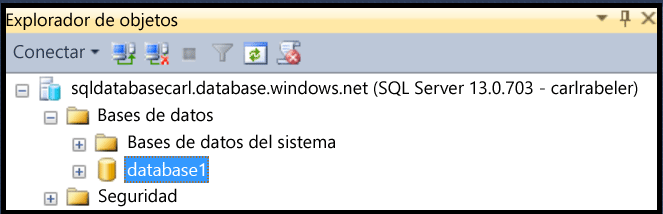
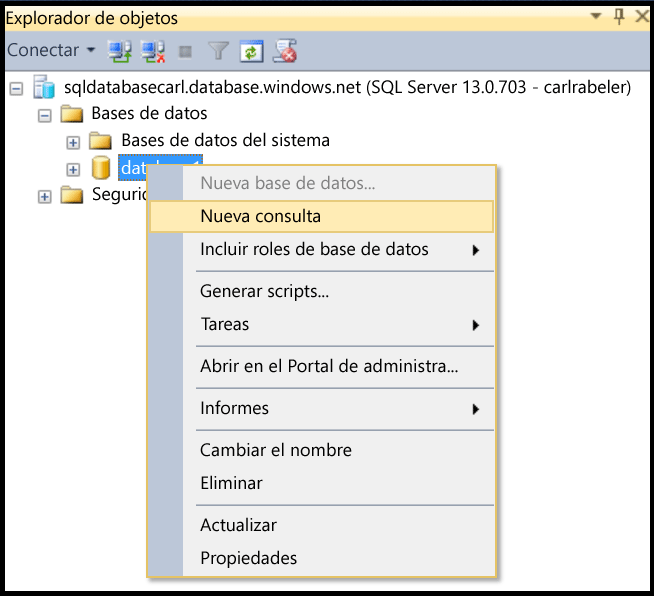
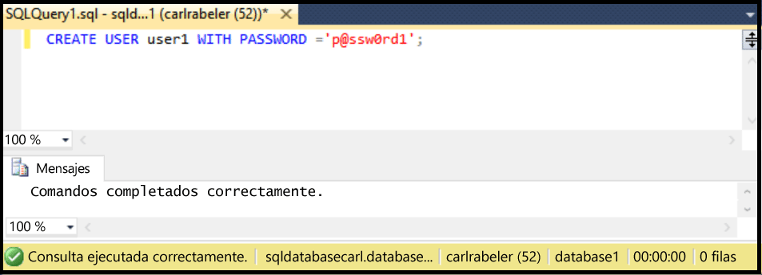

## Creación de un nuevo usuario de base de datos con SSMS

Los pasos siguientes se basan en el supuesto de que va a usar SSMS, está conectado a Base de datos SQL en el Explorador de objetos y está conectado al servidor lógico de Base de datos SQL como un administrador de entidad de seguridad de nivel de servidor o con una cuenta de usuario con permisos para crear un nuevo usuario. Además, se supone que existe una base de datos de usuario en la que quiere crear una cuenta de usuario.

1. En el Explorador de objetos, expanda el nodo Bases de datos y seleccione la base de datos en el que quiere crear una nueva cuenta de usuario.

     

2. Haga clic con el botón derecho en la base de datos seleccionada y luego haga clic en **Consulta**.

     

3. En la ventana de consulta, edite y utilice la siguiente instrucción Transact-SQL para crear un usuario contenido en la base de datos de usuario.

    ```CREATE USER user1 WITH PASSWORD ='p@ssw0rd1';

     

<!---HONumber=AcomDC_0420_2016-->