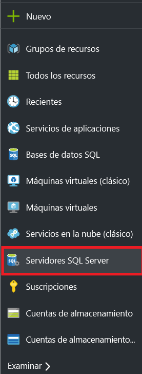
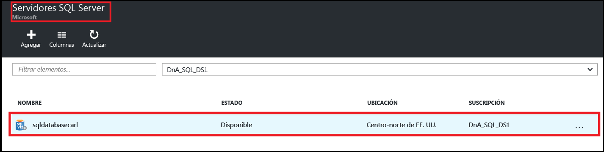
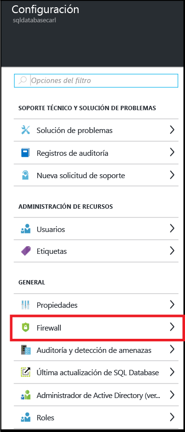
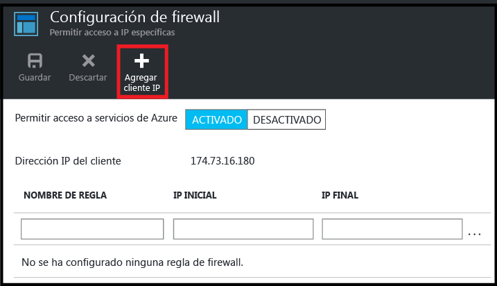
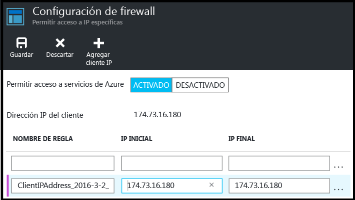
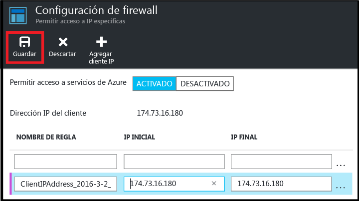

<!--
includes/sql-database-create-new-server-firewall-portal.md

Latest Freshness check:  2016-08-01 , rickbyh.

As of circa 2016-04-11, the following topics might include this include:
articles/sql-database/sql-database-get-started-tutorial.md
articles/sql-database/sql-database-configure-firewall-settings

-->
## Creación de un nuevo firewall de nivel de servidor SQL de Azure

Utilice los pasos siguientes en el Portal de Azure para crear una regla de firewall de nivel de servidor que permita conexiones desde una dirección IP individual (el equipo cliente) o un intervalo completo de direcciones IP con un servidor lógico SQL.

1. Si no está conectado, conéctese al [Portal de Azure](http://portal.azure.com).
2. En la hoja predeterminada, haga clic en **SQL Server**.

  	

2. En la hoja de SQL Server, haga clic en el servidor SQL Server en el que va a crear la regla de firewall.

 	
           
3. Revise las propiedades del servidor.

 	
      
4. En la hoja Configuración, haga clic en **Firewall**.

 	
    

 	> [AZURE.NOTE] También puede tener acceso en el nivel de servidor a la hoja **Configuración de Firewall** en la barra de herramientas de la hoja Base de datos.

5. Haga clic en **Agregar IP de cliente** para que Azure cree una regla para la dirección IP del cliente.

      

6. Opcionalmente, haga clic en la dirección IP que se agregó para editar la dirección del firewall y permitir el acceso a un intervalo de direcciones IP.

      
    
7. Haga clic en **Guardar** para crear la regla de firewall de nivel de servidor.

     

	>[AZURE.IMPORTANT] Puede que la dirección IP de su cliente cambie de vez en cuando, y es posible que no pueda acceder al servidor hasta que cree una nueva regla de firewall. Puede comprobar la dirección IP con [Bing](http://www.bing.com/search?q=my%20ip%20address) y, después, agregue una dirección IP o un intervalo de direcciones IP. Consulte [Administración de reglas de firewall de nivel de servidor existentes a través del Portal de Azure](sql-database-configure-firewall-settings.md#manage-existing-server-level-firewall-rules-through-the-azure-portal) para más información.

<!---HONumber=AcomDC_0803_2016-->