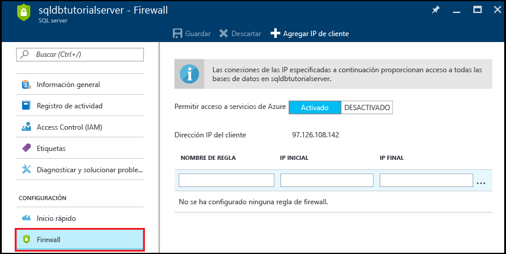
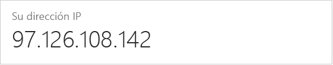

<!--
includes/sql-database-create-new-server-firewall-portal.md

Latest Freshness check:  2016-11-28 , rickbyh.

As of circa 2016-04-11, the following topics might include this include:
articles/sql-database/sql-database-get-started.md
articles/sql-database/sql-database-configure-firewall-settings
articles/sql-data-warehouse-get-started-provision.md

-->
### Creación de una regla de firewall de nivel a servidor en Azure Portal

1. En la hoja SQL Server, en Configuración, haga clic en **Firewall** para abrir la hoja Firewall para el servidor SQL Server.

    <!--  -->

2. Revise la dirección IP del cliente que se muestra y compruebe que se trata de la dirección IP en Internet en el explorador que desee (pregunte "¿Cuál es mi dirección IP?”). En ocasiones no coinciden por distintas razones.

    <!--  -->

3. Si las direcciones IP coinciden, haga clic en **Agregar IP de cliente**, en la barra de herramientas.

    

    > [!NOTE]
    > Puede abrir el firewall de SQL Database en el servidor para una sola dirección IP o para un intervalo de direcciones. Abrir el firewall permite a los administradores y usuarios de SQL iniciar sesión en cualquier base de datos del servidor para el que tengan unas credenciales válidas.
    >

4. Haga clic en **Guardar** en la barra de herramientas para guardar esta regla de firewall de nivel de servidor y, después, haga clic en **Aceptar**.

    

> [!Tip]
> Para ver un tutorial, consulte [Tutorial de SQL Database: crear un servidor, una regla de firewall de nivel de servidor, una base de datos de ejemplo, una regla de firewall de nivel de base de datos y conectar con SQL Server](../articles/sql-database/sql-database-get-started.md).    
>
