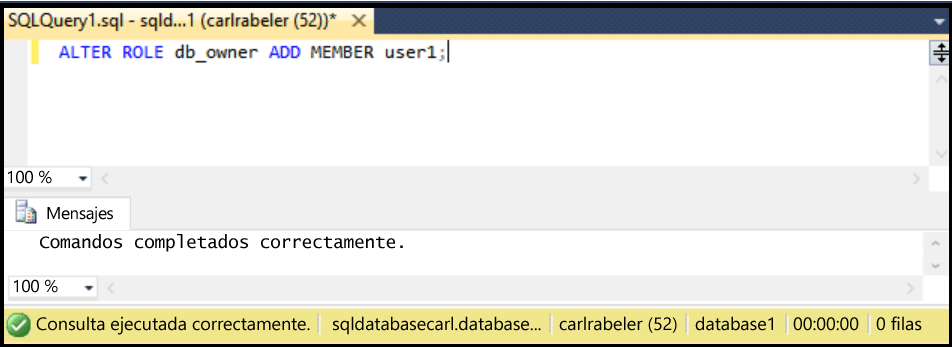

## Creación de un nuevo usuario de base de datos con SSMS

Los pasos siguientes se basan en el supuesto de que va a usar SSMS, está conectado a Base de datos SQL en el Explorador de objetos y está conectado al servidor lógico de Base de datos SQL como un administrador de entidad de seguridad de nivel de servidor o con una cuenta de usuario con permisos para conceder permisos de usuario. Además, se suponen que existe un usuario en la base de datos a la que desea conceder permisos de dbo.

1. En el Explorador de objetos, expanda el nodo Bases de datos y seleccione la base de datos con el usuario al que desea conceder permisos de dbo.

     

2. Haga clic con el botón derecho en la base de datos seleccionada y luego haga clic en **Consulta**.

     

3. En la ventana de consulta, edite y utilice la siguiente instrucción Transact-SQL para conceder permisos de dbo a un usuario específico.

    '''ALTER ROLE db\_owner ADD MEMBER user1;

     

<!---HONumber=AcomDC_0420_2016-->