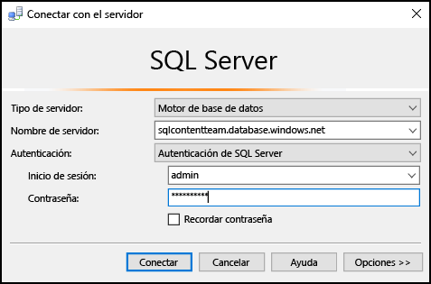
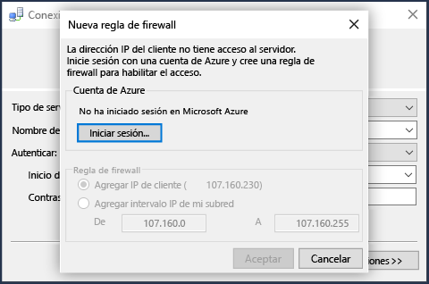

## Conexión a Base de datos SQL de Azure mediante la autenticación de SQL Server

Los pasos siguientes muestran cómo conectarse a un servidor SQL de Azure y a la base de datos con SSMS. Si no tiene un servidor y una base de datos, consulte [Creación de una Base de datos SQL en cuestión de minutos](../articles/sql-database/sql-database-get-started.md) para crear una.

1. Primero, escriba **Microsoft SQL Server Management Studio** en el cuadro de búsqueda de Windows y, a continuación, haga clic en la aplicación de escritorio para iniciar SSMS.

2. En la ventana **Conectar con el servidor**, escriba la información siguiente (si SSMS ya se está ejecutando, haga clic en **Conectar > Motor de base de datos** para que se abra la ventana **Conectar con el servidor**):

 - **Tipo de servidor**: el valor predeterminado es el motor de base de datos; no cambie este valor.
 - **Nombre del servidor**: escriba el nombre completo del servidor de Base de datos SQL de Azure con el formato siguiente: *&lt;servername>*.**database.windows.net**.
 - **Tipo de autenticación**: este artículo le muestra cómo conectarse mediante la **autenticación de SQL Server**. Para más información sobre la conexión con Azure Active Directory, consulte [Conectarse mediante la autenticación integrada de Active Directory](../articles/sql-database/sql-database-aad-authentication.md#connect-using-active-directory-integrated-authentication), [Conectarse mediante la autenticación de contraseña de Active Directory](../articles/sql-database/sql-database-aad-authentication.md#connect-using-active-directory-password-authentication) y [Connect using Active Directory Universal Authentication](../articles/sql-database/sql-database-ssms-mfa-authentication.md) (Conectarse mediante la autenticación universal de Active Directory).
 - **Nombre de usuario**: escriba el nombre de un usuario con acceso a una base de datos del servidor (por ejemplo, el *administrador del servidor* que configuró al crear el servidor).
 - **Contraseña**: escriba la contraseña para el usuario especificado (por ejemplo, la *contraseña* que configuró al crear el servidor).
   
       

3. Haga clic en **Conectar**.
 
4. De forma predeterminada, los servidores nuevos no tienen [reglas de firewall](../articles/sql-database/sql-database-firewall-configure.md) definidas por lo que a los clientes se les impide inicialmente la conexión. Si el servidor no tiene todavía una regla de firewall que permita a su dirección IP específica conectarse, SSMS le pedirá que la cree en el nivel del servidor para usted.

    Haga clic en **Iniciar sesión** y cree una regla de firewall de nivel de servidor. Debe ser un administrador de Azure para crear una regla de firewall de nivel de servidor.
 
       
 

5. Después de conectarse correctamente a Base de datos SQL de Azure, se abrirá el **Explorador de objetos** y podrá acceder a la base de datos para [realizar tareas administrativas o consultar los datos](../articles/sql-database/sql-database-manage-azure-ssms.md).
 
     
 
     
## Solución de problemas de errores de conexión

Las causas más comunes de los errores de conexión son errores en el nombre del servidor y problemas de conectividad en la red. Recuerde que <*nombreDeServidor*> es el nombre del servidor, no de la base de datos, y que debe proporcionar el nombre completo del servidor: `<servername>.database.windows.net`

Además, compruebe que el nombre de usuario y la contraseña no contienen ningún error de escritura ni espacios adicionales (los nombres de usuario no distinguen entre mayúsculas y minúsculas, pero las contraseñas sí).

También puede establecer explícitamente el protocolo y el número de puerto mediante el nombre del servidor como en el siguiente caso: `tcp:servername.database.windows.net,1433`

Los problemas de conectividad de la red también pueden provocar tiempos de espera y errores de conexión. Solo con volver a intentar la conexión (cuando ya está seguro de que el nombre del servidor, las credenciales y las reglas de firewall son correctos) puede solucionar el problema.

<!---HONumber=AcomDC_0824_2016-->