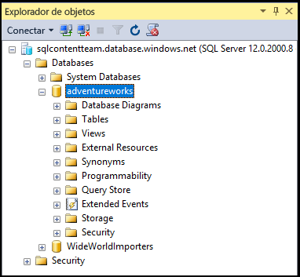

## Conexión a Base de datos SQL de Azure mediante un inicio de sesión de entidad de seguridad de nivel de servidor

Siga estos pasos para conectarse a Base de datos SQL de Azure con SSMS utilizando un inicio de sesión de entidad de seguridad de nivel de servidor.

1. Escriba "Microsoft SQL Server Management Studio" en el cuadro de búsqueda de Windows y, a continuación, haga clic en la aplicación de escritorio para iniciar SSMS.

2. En la ventana Conectar al servidor, escriba la siguiente información:

 - **Tipo de servidor**: el valor predeterminado es el motor de base de datos; no cambie este valor.
 - **Nombre del servidor**: escriba el nombre del servidor que hospeda la base de datos SQL con el formato siguiente: *&lt;servername>*.**database.windows.net**.
 - **Tipo de autenticación**: si acaba de empezar, seleccione Autenticación de SQL. Si ha habilitado Active Directory para el servidor lógico de Base de datos SQL, puede seleccionar Autenticación de contraseña de Active Directory o Autenticación integrada de Active Directory.
 - **Nombre de usuario**: si ha seleccionado Autenticación de SQL o Autenticación de contraseña de Active Directory, escriba el nombre de un usuario con acceso a una base de datos en el servidor.
 - **Contraseña**: si ha seleccionado Autenticación de SQL o Autenticación de contraseña de Active Directory, escriba la contraseña para el usuario especificado.
   
       

3. Haga clic en **Conectar**.
 
4. Si la dirección IP de su cliente no tiene acceso al servidor lógico de Base de datos SQL, se le pedirá que inicie sesión en una cuenta de Azure y que cree una regla de firewall de nivel de servidor. Si es administrador de una suscripción de Azure, haga clic en **Iniciar sesión** para crear una regla de firewall de nivel de servidor. En caso contrario, pida a un administrador de Azure que la cree.
 
      
 
1. Si es administrador de una suscripción de Azure y necesita iniciar sesión, cuando aparezca la página de inicio de sesión, proporcione las credenciales de su suscripción de Azure e inicie la sesión.

      
 
1. Después de haber iniciado sesión en Azure correctamente, revise la regla de firewall de nivel de servidor propuesta (puede modificarla para permitir un intervalo de direcciones IP) y, luego, haga clic en **Aceptar** para crear la regla de firewall y completar la conexión a Base de datos SQL.
 
      
 
5. Si las credenciales le conceden acceso, se abre el Explorador de objetos donde puede realizar tareas administrativas o consultar datos.
 
     
 
     
## Solución de problemas de errores de conexión

La razón más común de los errores de conexión son errores en el nombre del servidor (recuerde, <*servername>* es el nombre del servidor lógico, no el de la base de datos), el nombre de usuario o la contraseña, así como el servidor que no permite conexiones por motivos de seguridad.

<!---HONumber=AcomDC_0601_2016-->