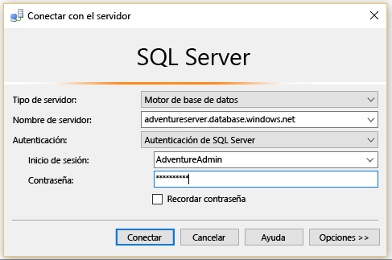
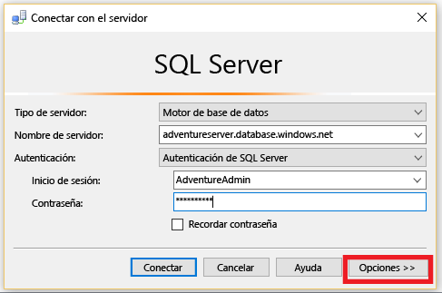
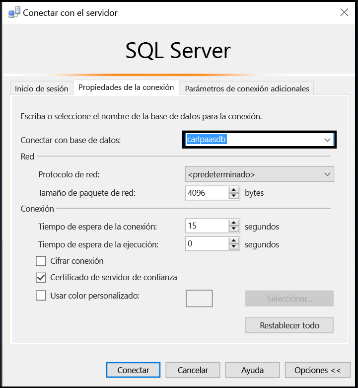
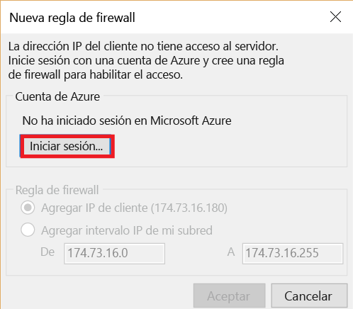
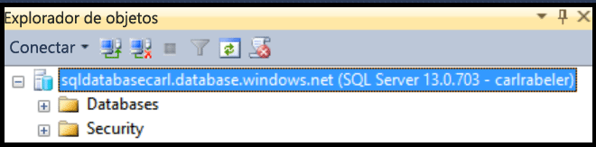

## Conexión a Base de datos SQL de Azure como usuario

Siga estos pasos para conectarse a Base de datos SQL de Azure con SSMS como usuario.

1. Escriba "Microsoft SQL Server Management Studio" en el cuadro de búsqueda de Windows y, a continuación, haga clic en la aplicación de escritorio para iniciar SSMS.

2. En la ventana Conectar al servidor, escriba la siguiente información:

- **Tipo de servidor**: el valor predeterminado es el motor de base de datos; no cambie este valor.
 - **Nombre del servidor**: escriba el nombre del servidor que hospeda la base de datos SQL con el formato siguiente: *&lt;servername>*.**database.windows.net**.
 - **Tipo de autenticación**: si acaba de empezar, seleccione Autenticación de SQL. Si ha habilitado Active Directory para el servidor lógico de Base de datos SQL, puede seleccionar Autenticación de contraseña de Active Directory o Autenticación integrada de Active Directory.
 - **Nombre de usuario**: si ha seleccionado Autenticación de SQL o Autenticación de contraseña de Active Directory, escriba el nombre de un usuario con acceso a una base de datos en el servidor.
 - **Contraseña**: si ha seleccionado Autenticación de SQL o Autenticación de contraseña de Active Directory, escriba la contraseña para el usuario especificado.
   
       

3. Haga clic en **Opciones** para especificar la base de datos a la que desea conectarse.

      
 
4. En **Conectar con base de datos**, seleccione la base de datos a la que desea conectarse.

     

5. Haga clic en **Conectar**.
 
6. Si la dirección IP de su cliente no tiene acceso al servidor lógico de Base de datos SQL, se le pedirá que inicie sesión en una cuenta de Azure y que cree una regla de firewall de nivel de servidor. Si es administrador de una suscripción de Azure, haga clic en **Iniciar sesión** para crear una regla de firewall de nivel de servidor. En caso contrario, pida a un administrador que cree una regla de firewall de nivel de servidor o una regla de firewall de nivel de base de datos en la base de datos a la que intenta conectarse.
 
      
 
7. Si las credenciales le conceden acceso a la base de datos especificada, se abre el Explorador de objetos donde puede realizar tareas administrativas o consultar datos, según los permisos de usuario.
  
      
      
 
 ## Solución de problemas de errores de conexión

La razón más común de los errores de conexión son errores en el nombre del servidor (recuerde, <*servername>* es el nombre del servidor lógico, no el de la base de datos), el nombre de usuario o la contraseña, así como el servidor que no permite conexiones por motivos de seguridad.

<!---HONumber=AcomDC_0504_2016-->