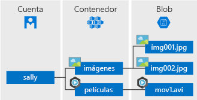

## ¿Qué es Blob Storage?
El Almacenamiento de blobs de Azure es un servicio para almacenar grandes cantidades de datos de objetos no estructurados, como texto o datos binarios, a los que puede acceder desde cualquier lugar del mundo a través de HTTP o HTTPS. Puede usar el almacenamiento de blobs para exponer datos públicamente o para almacenar datos de la aplicación de manera privada.

El almacenamiento de blobs suele usarse para realizar las siguientes tareas:

* Servicio de imágenes o documentos directamente a un explorador.
* Almacenamiento de archivos para acceso distribuido.
* Streaming de audio y vídeo.
* Almacenamiento de datos para copia de seguridad y restauración, recuperación ante desastres y archivado.
* Almacenamiento de datos para el análisis en local o en un servicio hospedado de Azure.

## Conceptos de Blob service
Blob service contiene los componentes siguientes:

* **Cuenta de almacenamiento**: todo el acceso a Azure Storage se realiza a través de una cuenta de almacenamiento. Esta cuenta de almacenamiento puede ser una **cuenta de almacenamiento de uso general** o una **cuenta de Blob Storage**, que sirve para almacenar objetos o blobs. Para más información, consulte [Acerca de las cuentas de Azure Storage](../articles/storage/common/storage-create-storage-account.md).
* **Contenedor**: un contenedor proporciona una agrupación de un conjunto de blobs. Todos los blobs deben residir en un contenedor. Además, una cuenta puede disponer de un número ilimitado de contenedores y un contenedor puede almacenar un número ilimitado de blobs. Tenga en cuenta que el nombre del contenedor debe estar en minúsculas.
* **Blob:** archivo de cualquier tipo y tamaño. Azure Storage ofrece tres tipos de blobs: blobs en bloques, blobs en anexos y blobs en páginas.
  
    *blobs en bloques* son ideales para almacenar archivos binarios o de texto, como documentos y archivos multimedia. Un único blob en bloques puede contener un máximo de 50 000 bloques de hasta 100 MB cada uno, hasta un tamaño total de algo más de 4,75 GB (100 MB × 50 000). 

    *blobs en anexos* se parecen a los blobs en bloques porque se componen de bloques, pero están optimizados para las operaciones de anexión, por lo que son útiles para escenarios de registro. Un único blob en anexos puede contener un máximo de 50 000 bloques de hasta 4 MB cada uno, hasta un tamaño total de algo más de 195 GB (4 MB × 50 000).
  
    *blobs en páginas* pueden tener un tamaño de hasta 1 TB y son más eficaces para operaciones frecuentes de lectura y escritura. Azure Virtual Machines usa blobs en páginas como discos de sistema operativo y de datos.
  
    Para más información acerca de la nomenclatura de contenedores y blobs, consulte [Asignación de nombres y referencias a contenedores, blobs y metadatos](/rest/api/storageservices/Naming-and-Referencing-Containers--Blobs--and-Metadata).

