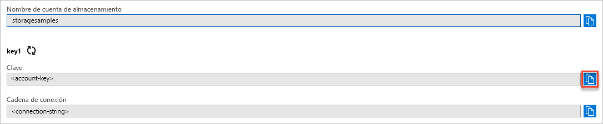

## Copia de las credenciales desde Azure Portal

La aplicación de ejemplo debe autenticar el acceso a su cuenta de almacenamiento. Para realizar la autenticación, proporcionará a la aplicación sus credenciales de cuenta de almacenamiento en forma de una cadena de conexión. Para ver las credenciales de la cuenta de almacenamiento:

1. Acceda a [Azure Portal](https://portal.azure.com).
2. Busque su cuenta de almacenamiento.
3. En la sección **Configuración** de la información general de la cuenta de almacenamiento, seleccione **Claves de acceso**. Aparecen las claves de acceso de la cuenta, así como la cadena de conexión completa de cada clave.
4. Observe el nombre de la cuenta de almacenamiento; lo deberá proporcionar para autenticarse.   
5. Busque el valor de **Clave** en **key1** y haga clic en el botón **Copiar** para copiar la clave de la cuenta.

    
