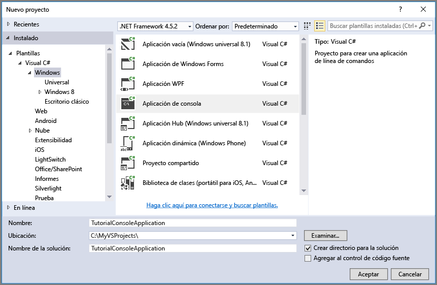

## <a name="set-up-your-development-environment"></a>Configuración de su entorno de desarrollo
A continuación, configure el entorno de desarrollo en Visual Studio para poder probar los ejemplos de código de esta guía.

### <a name="create-a-windows-console-application-project"></a>Creación de un proyecto de aplicación de consola de Windows
En Visual Studio, cree una nueva aplicación de consola de Windows. Los siguientes pasos muestran cómo crear una aplicación de consola en Visual Studio 2017. Los pasos son similares en otras versiones de Visual Studio.

1. Seleccione **Archivo** > **Nuevo** > **Proyecto**.
2. Seleccione **Instalado** > **Plantillas** > **Visual C#** > **Escritorio clásico de Windows**.
3. Seleccione **Aplicación de consola (.NET Framework)**.
4. Escriba el nombre de la aplicación en el campo **Nombre**.
5. Seleccione **Aceptar**.



Todos los ejemplos de código de este tutorial se pueden agregar al método `Main()` del archivo `Program.cs` de la aplicación de consola.

La biblioteca del cliente de Azure Storage se puede usar en cualquier tipo de aplicación. NET, incluidos cualquier servicio en la nube o aplicación web de Azure, y aplicaciones de escritorio o móviles. En esta guía, usamos una aplicación de consola para hacerlo más sencillo.

### <a name="use-nuget-to-install-the-required-packages"></a>Uso de NuGet para instalar los paquetes necesarios
Para completar este tutorial, es preciso que haga referencia a dos paquetes en el proyecto:

* [Biblioteca del cliente de Microsoft Azure Storage para .NET](https://www.nuget.org/packages/WindowsAzure.Storage/): este paquete proporciona acceso mediante programación a los recursos de datos de la cuenta de almacenamiento.
* [Biblioteca de Administrador de configuración de Microsoft Azure para .NET](https://www.nuget.org/packages/Microsoft.WindowsAzure.ConfigurationManager/): este paquete proporciona una clase para analizar una cadena de conexión en un archivo de configuración, independientemente del lugar en que se ejecute la aplicación.

Puede usar NuGet para obtener ambos paquetes. Siga estos pasos:

1. Haga clic con el botón derecho en el proyecto, en el **Explorador de soluciones**, y elija **Administrar paquetes NuGet**.
2. Busque "WindowsAzure.Storage" en línea y seleccione **Instalar** para instalar la biblioteca cliente de Storage y sus dependencias.
3. Busque "WindowsAzure.ConfigurationManager" en línea y seleccione **Instalar** para instalar Azure Configuration Manager.

> [!NOTE]
> El paquete de la biblioteca del cliente de almacenamiento también se incluye en el [SDK de Azure para .NET](https://azure.microsoft.com/downloads/). Sin embargo, se recomienda que instale también la biblioteca del cliente de almacenamiento desde NuGet para garantizar que siempre dispone de la versión más reciente.
> 
> Las dependencias de ODataLib en la Biblioteca del cliente de Storage para .NET las resuelven los paquetes de ODataLib disponibles en NuGet, no desde WCF Data Services. A través de NuGet, es posible descargar directamente las bibliotecas ODataLib o bien hacer referencia a ellas con el código del proyecto. Los paquetes ODataLib específicos utilizados por la biblioteca de cliente de almacenamiento son [OData](http://nuget.org/packages/Microsoft.Data.OData/), [Edm](http://nuget.org/packages/Microsoft.Data.Edm/) y [Spatial](http://nuget.org/packages/System.Spatial/). Aunque las clases de Azure Table Storage usan estas bibliotecas, son dependencias necesarias para programar con la biblioteca de cliente de almacenamiento.
> 
> 

### <a name="determine-your-target-environment"></a>Determine su entorno de destino
Tiene dos opciones de entorno para ejecutar los ejemplos de esta guía:

* Puede ejecutar el código en una cuenta de Azure Storage en la nube. 
* Puede ejecutar el código en el emulador de almacenamiento de Azure. El emulador de almacenamiento es un entorno local que emula una cuenta de Azure Storage en la nube. El emulador es una opción gratis para probar y depurar el código mientras la aplicación está en desarrollo. El emulador usa una cuenta y una clave conocidas. Para más información, consulte [Uso del emulador de Azure Storage para desarrollo y pruebas](../articles/storage/common/storage-use-emulator.md).

Si el destino es una cuenta de Storage en la nube, copie la clave de acceso principal de su cuenta de Storage de Azure Portal. Para obtener más información, consulte [Visualización y copia de las claves de acceso de almacenamiento](../articles/storage/common/storage-create-storage-account.md#view-and-copy-storage-access-keys).

> [!NOTE]
> Puede dirigirse al emulador de almacenamiento para evitar incurrir en cualquier coste asociado con Azure Storage. Sin embargo, si selecciona dirigirse a una cuenta de almacenamiento de Azure en la nube, los costes derivados de la realización de este tutorial serán insignificantes.
> 
> 

### <a name="configure-your-storage-connection-string"></a>Configuración de la cadena de conexión de almacenamiento.
La biblioteca del cliente de Azure Storage para .NET admite el uso de una cadena de conexión de almacenamiento para configurar extremos y credenciales a fin de obtener acceso a los servicios de almacenamiento. La mejor manera de conservar la cadena de conexión de almacenamiento es mediante un archivo de configuración. 

Para más información acerca de las cadenas de conexión, consulte [Configuración de una cadena de conexión a Azure Storage](../articles/storage/common/storage-configure-connection-string.md).

> [!NOTE]
> La clave de la cuenta de almacenamiento es similar a la contraseña raíz de la cuenta de almacenamiento. Siempre debe proteger la clave de la cuenta de almacenamiento. Evite distribuirla a otros usuarios, codificarla de forma rígida o guardarla en un archivo de texto que sea accesible a otros usuarios. Vuelva a generar la clave mediante Azure Portal si cree que puede verse comprometida.
> 
> 

Para configurar la cadena de conexión, abra el archivo `app.config` en el Explorador de soluciones de Visual Studio. Agregue el contenido del elemento `<appSettings>` , que se muestra a continuación. Reemplace `account-name` por el nombre de su cuenta de almacenamiento, y `account-key` por la clave de acceso de su cuenta:

```xml
<configuration>
    <startup> 
        <supportedRuntime version="v4.0" sku=".NETFramework,Version=v4.5.2" />
    </startup>
    <appSettings>
        <add key="StorageConnectionString" value="DefaultEndpointsProtocol=https;AccountName=account-name;AccountKey=account-key" />
    </appSettings>
</configuration>
```

Por ejemplo, el valor de configuración es similar a:

```xml
<add key="StorageConnectionString" value="DefaultEndpointsProtocol=https;AccountName=storagesample;AccountKey=GMuzNHjlB3S9itqZJHHCnRkrokLkcSyW7yK9BRbGp0ENePunLPwBgpxV1Z/pVo9zpem/2xSHXkMqTHHLcx8XRA==" />
```

Para elegir como destino el emulador de almacenamiento, puede utilizar un acceso directo que se asigna al nombre y la clave conocidas de la cuenta. En ese caso, la configuración de la cadena de conexión es:

```xml
<add key="StorageConnectionString" value="UseDevelopmentStorage=true;" />
```

