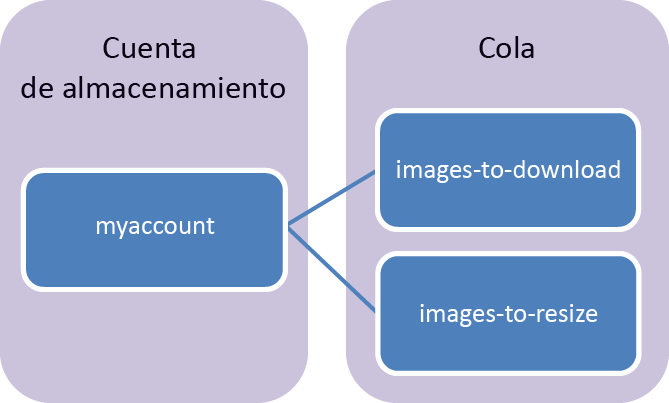

## ¿Qué es el almacenamiento en cola?
El almacenamiento en cola de Azure es un servicio para almacenar grandes cantidades de mensajes a los que puede obtenerse acceso desde cualquier lugar del mundo a través de llamadas autenticadas con HTTP o HTTPS. Un único mensaje en cola puede tener un tamaño de hasta 64 KB y una cola puede contener millones de mensajes, hasta el límite de capacidad total de una cuenta de almacenamiento.

El almacenamiento en cola suele usarse para realizar las siguientes tareas:

* Creación de trabajo pendiente para el procesamiento asincrónico
* Transferencia de mensajes de un rol web de Azure a un rol de trabajo de Azure

## Conceptos del servicio Cola
El servicio Cola contiene los siguientes componentes:

* **Formato URL:** las colas son direccionables mediante el formato de dirección URL siguiente: http://`<storage account>`.queue.core.windows.net/`<queue>` 
  
    La siguiente dirección URL dirige a una cola del diagrama:
  
        http://myaccount.queue.core.windows.net/images-to-download
* **Cuenta de almacenamiento:** todo el acceso a Almacenamiento de Azure se realiza a través de una cuenta de almacenamiento. Consulte [Objetivos de escalabilidad y rendimiento del almacenamiento de Azure](../articles/storage/storage-scalability-targets.md) para obtener información sobre la capacidad de la cuenta de almacenamiento.
* **Cola:** una cola contiene un conjunto de mensajes. Todos los mensajes deben encontrarse en una cola. Tenga en cuenta que el nombre de la cola debe ir en minúsculas. Para más información, consulte [Asignar nombres a colas y metadatos](https://msdn.microsoft.com/library/azure/dd179349.aspx).
* **Mensaje:** un mensaje, en cualquier formato, de hasta 64 KB. El tiempo máximo que un mensaje puede permanecer en la cola es de 7 días.

