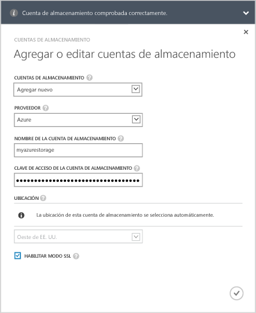
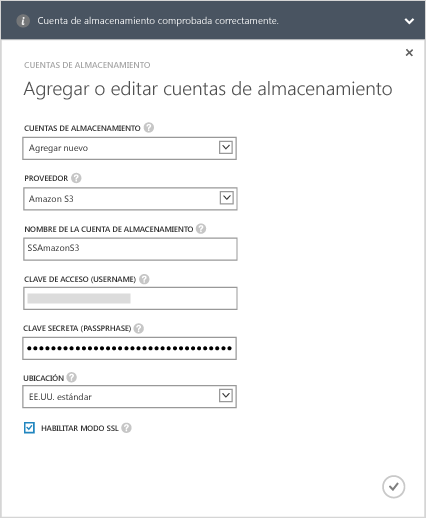
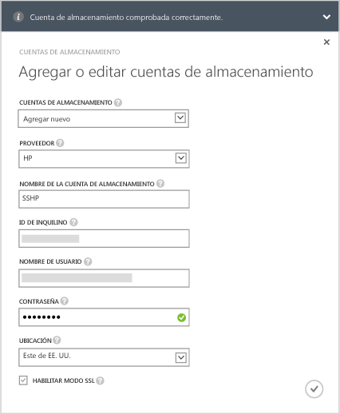
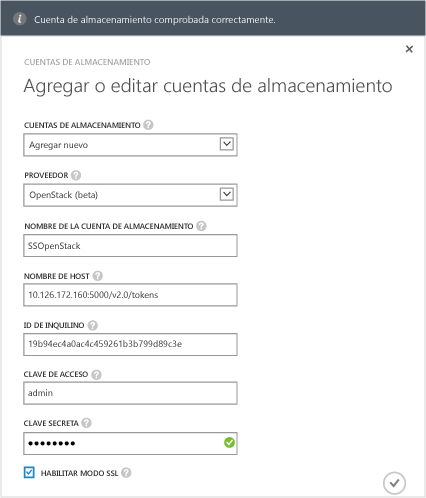

<!--author=alkohli last changed: 9/17/15-->

#### Para agregar una cuenta de almacenamiento en StorSimple 8000 Series Update 1.0
1. En la página de aterrizaje del servicio de Administrador de StorSimple, seleccione el servicio y haga doble clic en él. Esto le llevará a la página **Inicio rápido** . Seleccione la página **Configurar** .
2. Haga clic en **Agregar/editar cuenta de almacenamiento**.
3. En el cuadro de diálogo **Agregar o editar cuenta de almacenamiento**, haga clic en **Agregar nueva**.
4. En el campo **Proveedor** , seleccione el proveedor de servicios en la nube adecuado. Los proveedores admitidos son Azure, Amazon S3, Amazon S3 con RRS, HP y OpenStack. Especifique las credenciales y la ubicación asociada con la cuenta de almacenamiento de los proveedores de servicios en la nube. Los campos que se presentan para las credenciales serán diferentes según el proveedor de servicios en la nube que haya especificado. 
   
   * Si ha seleccionado Azure como proveedor de servicios en la nube, proporcione el **nombre** y la **clave de acceso** principal para la cuenta de Microsoft Azure Storage. Para una cuenta de Azure, la ubicación se rellenará automáticamente.
     
        
   * Si ha seleccionado Amazon S3 o Amazon S3 con RRS, proporcione un **Nombre de cuenta de almacenamiento** descriptivo, una **Clave de acceso** y una **Clave secreta**. Para Amazon S3 y Amazon S3 con RRS, se admiten las siguientes ubicaciones:
     
     * EE.UU. estándar
     * Oeste de EE. UU. (Oregon)
     * Oeste de EE. UU. (Norte de California)
     * UE (Irlanda)
     * Asia Pacífico (Singapur)
     * Asia Pacífico (Sídney)
     * Asia Pacífico (Tokio)
     * Sudamérica (Sao Paulo)
       
       
   * Si ha seleccionado HP como proveedor de servicios en la nube, proporcione un **nombre de cuenta de almacenamiento** descriptivo, un **identificador de inquilino**, un **nombre de usuario** y una **contraseña**. Para HP, se admiten las siguientes ubicaciones:
     
     * Este de EE. UU.
     * Oeste de EE. UU.
       
       
   * Si ha seleccionado **Openstack** como el proveedor de servicios en la nube, proporcione un **Nombre de host**, una **clave de acceso** y una **clave secreta**.
     
     > [!NOTE]
     > Se permite un nombre descriptivo en todos los proveedores de servicios en la nube, a excepción de Azure. Puede usar nombres descriptivos diferentes y crear más de una cuenta de almacenamiento con el mismo conjunto de credenciales.
     > 
     > 
     
        
5. Seleccione **Habilitar modo SSL** para crear un canal seguro para la comunicación de red entre su dispositivo y la nube. Desactive la casilla **Habilitar modo SSL** solo si está trabajando dentro de una nube privada.
   
   > [!NOTE]
   > Si usa HP como proveedor, siempre se habilitará SSL.
   > 
   > 
6. Haga clic en el icono de marca de verificación  . Recibirá una notificación cuando la cuenta de almacenamiento se cree correctamente.
7. La cuenta de almacenamiento recién creada se mostrará en la página **Configurar** bajo **Cuentas de almacenamiento**. Haga clic en **Guardar** para guardar la nueva cuenta de almacenamiento. Haga clic en **Aceptar** cuando se le pida confirmación.

