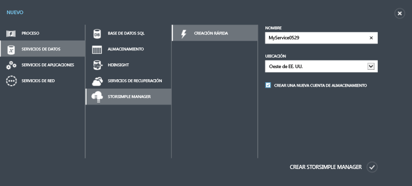
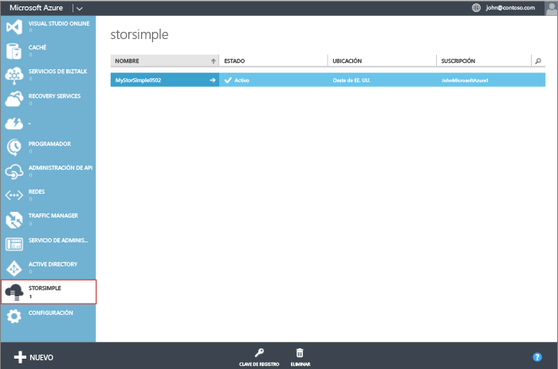

<properties 
   pageTitle="Crear un nuevo servicio de Administrador de StorSimple"
   description="Se describe cómo crear una nueva instancia del servicio de Administrador de StorSimple."
   services="storsimple"
   documentationCenter="NA"
   authors="SharS"
   manager="adinah"
   editor="tysonn" /> 
<tags 
   ms.service="storsimple"
   ms.devlang="NA"
   ms.topic="article"
   ms.tgt_pltfrm="NA"
   ms.workload="TBD"
   ms.date="04/28/2015"
   ms.author="v-sharos" />

### Para crear un nuevo servicio

1. Use las credenciales de su cuenta Microsoft para iniciar sesión en el Portal de administración de Microsoft Azure aquí: [Portal de administración de Azure](https://manage.windowsazure.com/).

2. En el Portal de administración, haga clic en **Nuevo** > **Servicios de datos** > **Administrador de StorSimple** > **Creación rápida**.

3. En el formulario que aparece, haga lo siguiente:
  1. Proporcione un **Nombre** único para el servicio. Se trata de un nombre descriptivo que sirve para identificar el servicio. El nombre puede tener entre 2 y 50 caracteres que pueden ser letras, números y guiones. El nombre debe empezar y terminar con una letra o un número.
  2. Proporcione una **Ubicación** para el servicio. La ubicación hace referencia a la región geográfica donde desea implementar el dispositivo.
  3. Elija una **Suscripción** en la lista desplegable. La suscripción está vinculada a la cuenta de facturación. Este campo no está presente si tiene una sola suscripción.
  4. Seleccione **Crear una cuenta de almacenamiento nueva** para crear automáticamente una cuenta de almacenamiento con el servicio. Esta cuenta de almacenamiento tendrá un nombre especial, como "storsimplebwv8c6dcnf."
  5. Haga clic en **Crear Administrador de StorSimple** para crear el servicio.

       

     Se le dirigirá a la página de aterrizaje del **Servicio**. La creación del servicio tardará unos minutos. Después de que el servicio se cree correctamente, se le notificará de forma adecuada y el estado del servicio cambiará a **Activo**.
 
       

<!--HONumber=52-->
