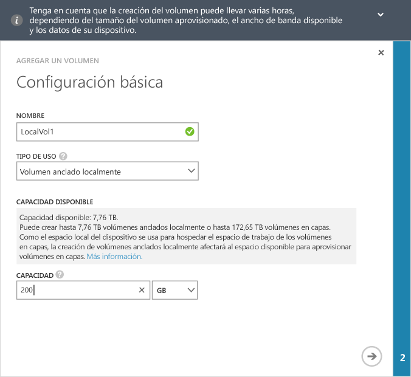
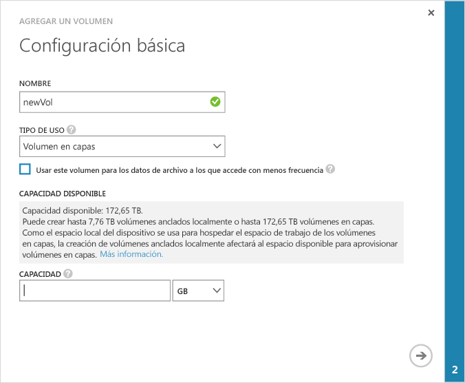
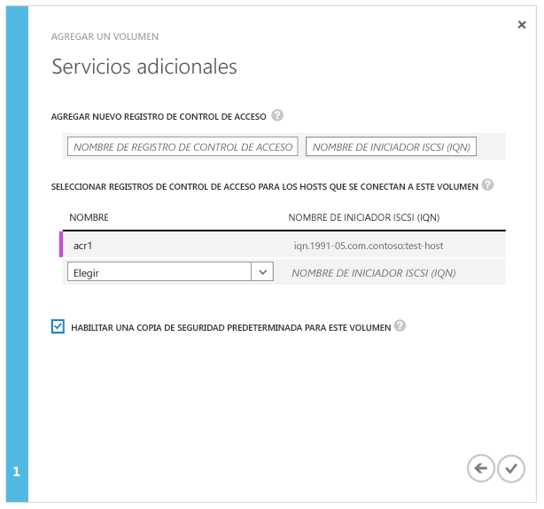

<!--author=alkohli last changed: 08/16/2016-->

#### Para crear un volumen
1. En la página **Inicio rápido** del dispositivo, haga clic en **Agregar un volumen** para que se inicie el asistente correspondiente.
2. En el Asistente para agregar volúmenes, en **Configuración básica**:
   
   1. Escriba un **Nombre** para el volumen.
   2. En la lista desplegable, seleccione el **Tipo de uso** para el volumen. Para cargas de trabajo que requieren garantías locales, latencias bajas y un rendimiento más alto, seleccione un volumen **Localmente anclado** . Para todos los demás datos, seleccione un volumen **En capas** . Si usa este volumen para datos de archivo, seleccione **Usar este volumen para los datos de archivo a los que accede con menos frecuencia**. 
      
       Un volumen localmente anclado se aprovisiona de forma intensa y garantiza que los datos principales del volumen continúen siendo locales en el dispositivo y que no se traspasan a la nube.  Si crea un volumen localmente anclado, el dispositivo comprobará el espacio disponible en los niveles locales para aprovisionar el volumen del tamaño solicitado. La operación que consiste en crear un volumen localmente anclado puede implicar traspasar los datos existentes del dispositivo a la nube, por lo que la creación del volumen puede llevar mucho tiempo. El tiempo total depende del tamaño del volumen aprovisionado, el ancho de banda de red disponible y los datos en el dispositivo. 
      
       Un volumen en capas se aprovisiona de manera fina y se puede crear rápidamente. Si utiliza el volumen en capas para los datos de archivo, al seleccionar **Usar este volumen para los datos de archivo a los que accede con menos frecuencia** se cambiará el tamaño del fragmento de desduplicación del volumen a 512 KB. Si este campo no está activado, el volumen correspondiente en capas utilizará un tamaño del fragmento de 64 KB. Un mayor tamaño de fragmento de desduplicación permite que el dispositivo acelere la transferencia de datos de archivado de gran tamaño a la nube.
   3. Especifique la **Capacidad aprovisionada** para el volumen. Tome nota de la capacidad que está disponible en función del tipo de volumen seleccionado. El tamaño del volumen especificado no debe superar el espacio disponible.
      
       Puede aprovisionar volúmenes anclados localmente de hasta 8,5 TB o volúmenes en capas de hasta 200 TB en el dispositivo 8100. En el dispositivo 8600 de mayor tamaño, puede aprovisionar volúmenes anclados localmente de hasta 22,5 TB o volúmenes en capas de hasta 500 TB. Como el espacio local del dispositivo es necesario para hospedar el espacio de trabajo de los volúmenes en capas, la creación de volúmenes localmente anclados afectará el espacio disponible para aprovisionar volúmenes en capas. Por lo tanto, si crea un volumen anclado localmente, se reducirá el espacio disponible para la creación de volúmenes en capas. De forma similar, si se crea un volumen en capas, se reducirá el espacio disponible para la creación de volúmenes anclados localmente.
      
       Si se aprovisiona un volumen anclado localmente de 8,5 TB (tamaño máximo permitido) en el dispositivo 8100, habrá agotado todo el espacio local disponible en él. No podrá crear ningún volumen en capas desde ese punto en adelante, porque no hay ningún espacio local en el dispositivo para hospedar el espacio de trabajo del volumen en capas. Los volúmenes existentes en capas también afectan al espacio disponible. Por ejemplo, si tiene un dispositivo 8100 que ya cuenta con volúmenes en capas de aproximadamente 106 TB, solo 4 TB de espacio estarán disponibles para volúmenes anclados localmente.
      
       La siguiente imagen muestra el cuadro de diálogo de **Configuración básica** de un volumen anclado de manera local.
      
        
      
       La siguiente imagen muestra el cuadro de diálogo de **Configuración básica** de un volumen en capas.
      
        
   
   1. Haga clic en el icono de flecha   para ir a la página siguiente.
3. En el cuadro de diálogo **Configuración adicional** , agregue un nuevo registro de control de acceso (ACR):
   
   1. Proporcione un **Nombre** para el ACR.
   2. En **Nombre del iniciador iSCSI**, proporcione el nombre completo del iSCSI (IQN) del host de Windows. Si no tiene el IQN, vaya a [Obtener el IQN de un host de Windows Server](#get-the-iqn-of-a-windows-server-host).
   3. En **¿Copia de seguridad predeterminada para este volumen?**, seleccione la casilla **Habilitar**. La copia de seguridad predeterminada creará una directiva que se ejecuta a las 22:30 cada día (hora del dispositivo) y crea una instantánea en la nube de este volumen.
      
      > [!NOTE]
      > Después de habilitar aquí la copia de seguridad, no se puede revertir. Necesitará modificar el volumen para modificar esta configuración.
      > 
      > 
      
      
4. Haga clic en el icono de marca de verificación  . Se creará un volumen con la configuración especificada.

