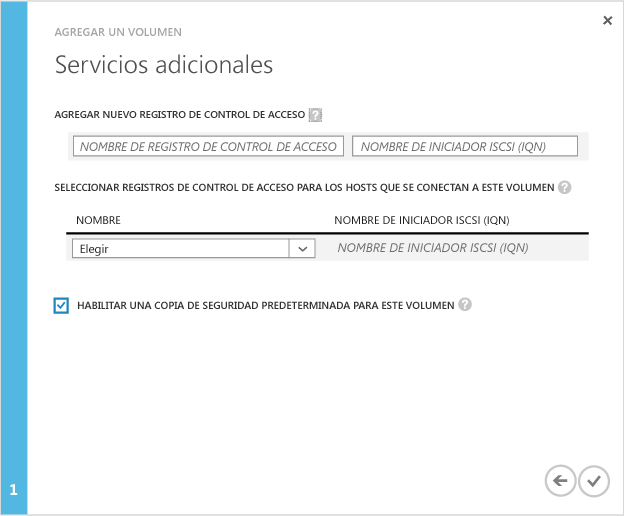

<!--author=SharS last changed: 11/18/15-->

#### Para crear un volumen

1. En la página **Inicio rápido** del dispositivo, haga clic en **Agregar un volumen**. Se iniciará el Asistente para agregar volúmenes.

2. En el Asistente para agregar volúmenes, en **Configuración básica**, haga lo siguiente:
   1. Proporcione un **Nombre** para el volumen.
   2. Especifique la **Capacidad aprovisionada** para el volumen en GB o TB. La capacidad del volumen debe estar entre 1 GB y 64 TB para un dispositivo físico.
   3. En la lista desplegable, seleccione el **Tipo de uso** para el volumen. Si está usando este volumen para datos de archivo, seleccione la casilla ** Usar este volumen para los datos de archivo a los que accede con menos frecuencia**. Para los demás casos de uso, seleccione simplemente **Volumen por niveles**. (Los volúmenes por niveles se denominaban anteriormente volúmenes principales).
   4. Haga clic en el icono de flecha  para ir a la página siguiente.

        

3. En la página **Configuración adicional**, agregue un nuevo registro de control de acceso (ACR):
   1. Proporcione un **Nombre** para el ACR.
   2. En **Nombre del iniciador iSCSI**, proporcione el nombre completo del iSCSI (IQN) del host de Windows. Si no tiene el IQN, vaya a [Obtener el IQN de un host de Windows Server](#get-the-iqn-of-a-windows-server-host).
   3. Recomendamos que habilite una copia de seguridad predeterminada seleccionando la casilla **Habilitar una copia de seguridad predeterminada para este volumen**. La copia de seguridad predeterminada creará una directiva que se ejecuta a las 22:30 cada día (hora del dispositivo) y crea una instantánea en la nube de este volumen.

        > [AZURE.NOTE] Después de habilitar aquí la copia de seguridad, no se puede revertir. Necesitará modificar el volumen para modificar esta configuración.

        

4. Haga clic en el icono de marca de verificación . Se creará un volumen con la configuración especificada.

 **Vídeo disponible**

Para ver un vídeo que muestra cómo crear un volumen de StorSimple, haga clic [aquí](http://azure.microsoft.com/documentation/videos/create-a-storsimple-volume/).

<!---HONumber=AcomDC_1125_2015-->