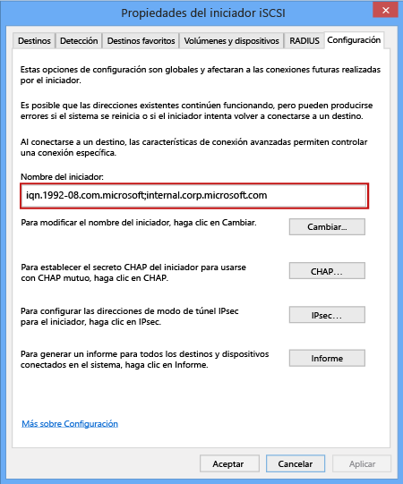

<properties 
   pageTitle="Obtener el IQN de un host de Windows"
   description="Se explica cómo obtener el nombre completo del iSCSI (IQN) de un equipo que ejecuta Windows Server 2012."
   services="storsimple"
   documentationCenter="NA"
   authors="SharS"
   manager="adinah"
   editor="tysonn" /> 
<tags 
   ms.service="storsimple"
   ms.devlang="NA"
   ms.topic="article"
   ms.tgt_pltfrm="NA"
   ms.workload="TBD"
   ms.date="04/27/2015"
   ms.author="v-sharos" />

### Para obtener el IQN de un host de Windows

1. Inicie el iniciador iSCSI de Microsoft en el host de Windows.

2. En la ventana **Propiedades del iniciador iSCSI**, en la pestaña **Configuración**, seleccione y copie la cadena desde el campo **Nombre de iniciador**.
 
    

3. Guarde esta cadena.

<!--HONumber=52-->
