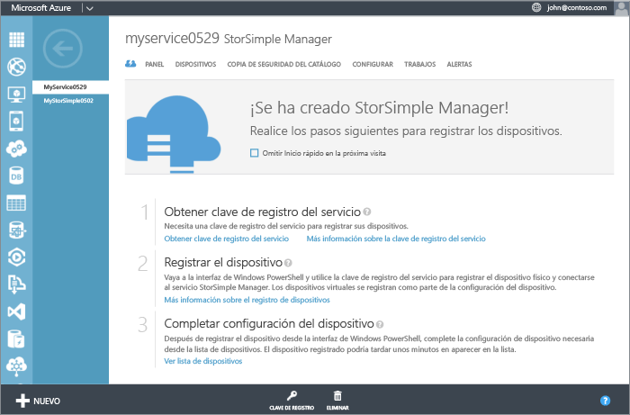
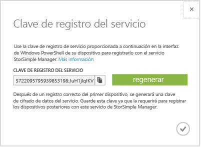

<properties 
   pageTitle="Obtener la clave de registro del servicio"
   description="Se explica cómo obtener la clave de registro que se usa para registrar todos los dispositivos StorSimple."
   services="storsimple"
   documentationCenter="NA"
   authors="SharS"
   manager="adinah"
   editor="tysonn" /> 
<tags 
   ms.service="storsimple"
   ms.devlang="NA"
   ms.topic="article"
   ms.tgt_pltfrm="NA"
   ms.workload="TBD"
   ms.date="04/01/2015"
   ms.author="v-sharos" />

### Para obtener la clave de registro del servicio de StorSimple

1. En la página **Servicio de Administrador de StorSimple**, haga clic en el servicio que creó. Esto le llevará a la página **Inicio rápido**. \(Puede hacer clic en el icono de inicio rápido  para acceder a la página **Inicio rápido** en cualquier momento\).

     

2. Haga clic en **Obtener la clave de registro del servicio**. También puede hacer clic en **Clave de registro**, en la parte inferior de la página. Tendrá que esperar unos minutos mientras se recupera la clave. Aparece el cuadro de diálogo **Clave de registro del servicio**.

     

3. Busque la clave de registro de servicio.

4. Haga clic en el icono de copia  para copiar la clave y guardarla para su uso posterior.

5. Haga clic en el icono de marca de verificación  para cerrar este cuadro de diálogo y volver a la página **Inicio rápido**.

> [AZURE.NOTE]La clave de registro del servicio se usa para registrar todos los dispositivos que se deben registrar con el servicio de Administrador de StorSimple.

 
<!--HONumber=52-->
