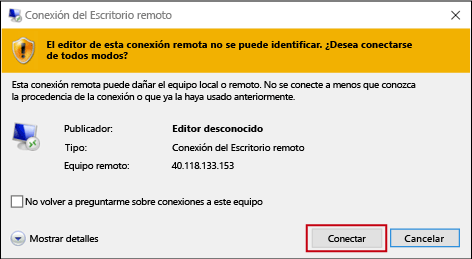
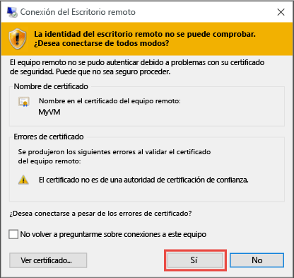

1. Al hacer clic en **Conectar** se crea y descarga un archivo de Protocolo de escritorio remoto (archivo .rdp). Haga clic en **Abrir** para utilizar este archivo.
2. Aparece una advertencia que indica que el archivo `.rdp` procede de un editor desconocido. Esto es normal. En la ventana de Escritorio remoto, haga clic en **Conectar** para continuar.
   
    
3. En la ventana **Seguridad de Windows**, seleccione **Más opciones** y, después, **Usar otra cuenta**. Escriba las credenciales de una cuenta en la máquina virtual y haga clic en **Aceptar**.
   
     **Cuenta local** : suele ser el nombre de usuario y la contraseña de la cuenta local que especificó al crear la máquina virtual. En este caso, el dominio es el nombre de la máquina virtual y se escribe como *nombreDeVm*&#92;*nombreDeUsuario*.  
   
    **Máquina virtual unida a dominio**: si la máquina virtual pertenece a un dominio, escriba el nombre de usuario con el formato *Dominio*&#92;*Nombre de usuario*. La cuenta también debe estar en el grupo Administradores o tener privilegios de acceso remoto a la máquina virtual.
   
    **Controlador de dominio** : si la máquina virtual es un controlador de dominio, escriba el nombre de usuario y la contraseña de una cuenta de administrador de dominio para ese dominio.
4. Haga clic en **Sí** para comprobar la identidad de la máquina virtual y finalizar el inicio de sesión.
   
   

