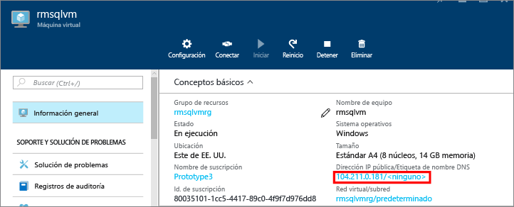
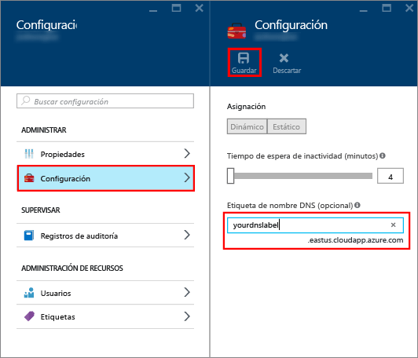
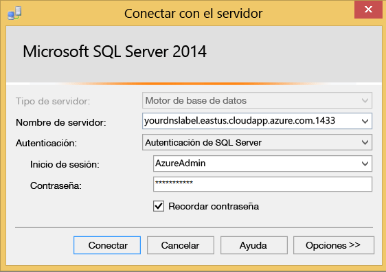

### Configuración de una etiqueta DNS para la dirección IP pública
Para conectarse al motor de base de datos de SQL Server desde Internet, primero debe configurar una etiqueta DNS para la dirección IP pública.

> [!NOTE]
> Si solo piensa conectarse a la instancia de SQL Server desde de la misma red virtual o de forma local, no necesita etiquetas DNS.
> 
> 

Para crear una etiqueta DNS, seleccione primero **Máquinas virtuales** en el portal. Seleccione su máquina virtual de SQL Server para que aparezcan sus propiedades.

1. En la hoja de la máquina virtual, seleccione **Dirección IP pública**
   
    
2. En las propiedades de la dirección IP pública, expanda **Configuración**.
3. Escriba un nombre para la etiqueta DNS. Este nombre es un registro A que se puede usar para conectarse a la máquina virtual de SQL Server utilizando el nombre en lugar de usar directamente la dirección IP.
4. Haga clic en el botón **Save** (Guardar).
   
    

### Conexión al motor de base de datos desde otro equipo
1. En otro equipo que esté conectado a Internet, abra SQL Server Management Studio (SSMS).
2. En el cuadro de diálogo **Conectar al servidor** o **Conectarse al motor de base de datos**, edite el valor de **Nombre del servidor**. Escriba el nombre DNS completo de la máquina virtual (que se determinó en la tarea anterior).
3. En el cuadro **Autenticación**, seleccione **Autenticación de SQL Server**.
4. En el cuadro **Inicio de sesión** , escriba un nombre de inicio de sesión de SQL válido.
5. En el cuadro **Contraseña** , escriba la contraseña de inicio de sesión.
6. Haga clic en **Conectar**.
   
    

